本文基于 vscode 的 PlantUML 插件绘制类图。

## 类的 UML 表示

使用 UML 表示一个类，主要由三部分组成。`类名`、`属性`、`方法`。其中`属性`和`方法`的访问修饰符用 `-` 、`#` 、`+` 表示 `private`、`protected`、`public`。

如图所示，表示`A`类有一个`private`属性，`protected` 构造函数和`public`方法。

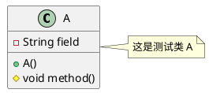

## 类的关系

在面向对象语言中，类的关系有很多种，可以概括为三类：`泛化`、`依赖`、`关联`。

### 泛化

泛化指父类跟子类的关系,表示`is-a`的关系。如父类是抽象类或普通类，则这种关系叫继承。如，父类是接口，则这种关系叫实现。UML 中，继承和实现由不同的标记表示。

### 继承

PlantUML 用 `--|>` 表示继承关系。实线和三角形的抽象表示，指向谁，即继承谁。

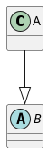

### 实现

PlantUML 用 `..|>` 表示实现关系。虚和三角形的抽象表示，指向谁，即实现谁。

```plantuml
@startuml

    class A
    interface C

    ' A 实现 C
    A ..|> C

@enduml
```

### 依赖

类之间，最弱的关联方式。常用于在 A 类的方法中使用 B 类的对象作为参数、局部变量或者对 B 类静态方法的调用。

PlantUML 用 `..>` 表示依赖关系。虚线和箭头的抽象表示，指向谁，即依赖谁。

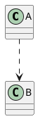

### 关联

关联关系，即对象之间的引用关系。常使用类的属性表达。

### 单向关联

B 类作为 A 类的属性，表示 A 类与 B 类有关联。 PlantUML 用 `-->` 表示单向关联。实线线和箭头的抽象表示，指向谁，即关联谁。

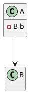

### 双向关联

B 类作为 A 类的属性同时，A 类也是 B 类的属性，表示双向关联。 PlantUML 用 `--` 表示双向关联。或者用`<-->`。

```plantuml
@startuml

    class A{
        - B b
    }
    class B{
        - A a
    }

    ' A 关联 B
    A -- B

@enduml
```

### 自关联

A 类关联 A 类自身。常见于单例模式。

```plantuml
@startuml

    class A{
        - A a
    }


    ' A 关联 A
    A --> A

@enduml
```

### 聚合

在关联关系的基础上，延伸出聚合关系，强的关联关系，表示`has-a`关系。整体与部分的关系，部分不依赖于整体，可独立存在。常用于成员变量。

如；汽车和轮胎的关系，轮胎可作为独立的商品出售。

PlantUML 用 `o--` 表示聚合关系。实线和空心菱形的抽象表示，指向谁，表示谁是整体。

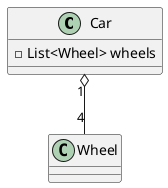

图中数字`1`和`4`也表示一对多关联。`N`对`N`同理。

### 组合

在关联关系的基础上，延伸出另外一种关联关系，组合关系，表示`contains-a`关系。整体与部分的关系，部分依赖于整体，不可独立存在。常用于成员变量。

如：身体和动作的关系。

PlantUML 用 `*--` 表示聚合关系。实线和实心菱形的抽象表示，指向谁，表示谁是整体。

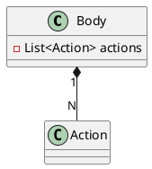

## PlantUML 排版

相比较其他的 UML 软件或插件。PlantUML 的优势在于，存储的是文本文件，可以方便的进行团队协作以及高度可定制化的依赖关系。但是，最大的缺点在于，排版是通过插件自动生成的，排版效果不尽人意。因此，PlantUML 提供四个关键字 `up` `down` `left` `right`。指定类与类之间的相对关系。

### default

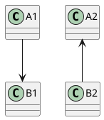

箭头向左时，被指向对象在上； 箭头向右时，被指向对象在下。

### up

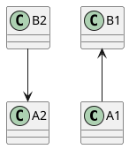

使用 up 时，被指向对象在上。

### down

使用 down 时，被指向对象在下。

### left

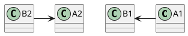

使用 left 时，被指向对象在左。

### right

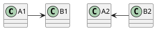

使用 right 时，被指向对象在右。

## 总结

画类图，只是 PlantUML 的功能之一，还可以使用它画[时序图](https://plantuml.com/zh/sequence-diagram)、[用例图](https://plantuml.com/zh/use-case-diagram)、`活动图`等。更多用法，请关注后续博客或[访问官网](http://plantuml.com/)。

## 参考

- [DHCPv6基础 | 曹世宏的博客](https://cshihong.github.io/2018/02/01/DHCPv6%E5%9F%BA%E7%A1%80/)
