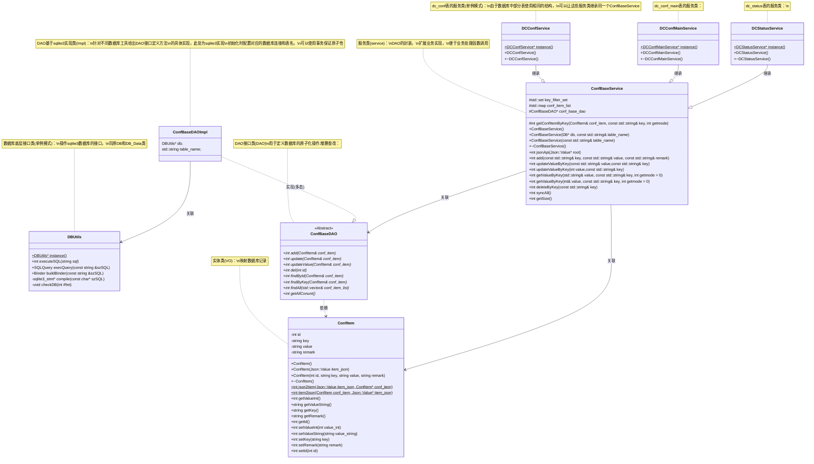

本文将会介绍如何使用 C++实现设计模式中的 DAO(数据访问对象模式)

## DAO 介绍

### 什么是 DAO

在计算机软件中，`数据访问对象`（data access object，DAO）是为某种类型的数据库或其他持久性机制提供一个`抽象接口`的`对象`。通过`映射`应用程序对`持久层`的调用，DAO 提供一些特定的数据操作，而`无需暴露数据库细节`。这种隔离支持`单一功能原则`。

数据访问对象模式（Data Access Object Pattern）或 DAO 模式用于把低级的数据访问 API 或操作从高级的业务服务中分离出来。

以下是数据访问对象模式的参与者:

- `数据访问对象接口（Data Access Object Interface）` - 该接口定义了在一个模型对象上要执行的标准操作。
- `数据访问对象实体类（Data Access Object concrete class）` - 该类实现了上述的接口。该类负责从数据源获取数据，数据源可以是数据库，也可以是 xml，或者是其他的存储机制。
- `模型对象/数值对象（Model Object/Value Object, VO）` - 该对象是简单的 POJO，包含了 get/set 方法来存储通过使用 DAO 类检索到的数据。


### DAO 的优势

1. `数据存储逻辑的分离`：一方面避免业务代码中混杂的数据库操作代码，另一方面，数据访问接口与数据访问实现相分离，这样精通数据库的人可以根据接口专注于数据库访问的最优化实现，而精通业务的人可以专注于业务逻辑编码。

2. `数据访问底层实现的分离`：DAO 模式将数据访问分为抽象层和实现层，分离了数据使用和数据访问的底层实现细节。这样可以在保持上层结构不变的情况下，通过更改底层实现来修改数据访问的机制，比如只要通过修改数据访问层实现，我们就可以部署在不同数据库平台上。

3. `资源管理和调度的分离`：数据访问逻辑从业务逻辑中脱离开来，使数据访问层实现统一的资源调度，通过数据库连接池和各种缓存机制的使用，可以保持上层系统不变的情况下来提高系统性能。

4. `数据抽象`：通过对底层数据的封装，开发人员可以使用面向对象思想对数据进行操作。比如通过调用方法获取数据比通过 SQL 语句访问数据库获取数据，在代码上更易于理解，清晰，对日后维护带来便利。

### DAO 的劣势

1. `抽象泄漏`：尽管抽象层可以屏蔽底层细节，让开发者可以专注于高层次的领域相关的知识与技能，但一旦底层出了问题，开发者不可避免的需要了解底层细节来帮助分析问题。所以抽象机制虽然节省了工作的时间，不过学习的时间是省不掉的。

2. `代码重复`：将 DAO 作为常规对象的抽象会隐藏每个数据库访问的高成本，并且可能强迫开发人员触发多个数据库查询来检索普通 SQL 查询中一次就可取回的信息。如果一个应用程序需要多个 DAO，人们可能发现自己对每个 DAO 重复基本上相同的创建、读取、更新和删除代码

3. `抽象反转(Abstraction inversion)`：抽象反转是一种反模式，当构造的用户需要在其中实现但未由其接口公开的函数时， 会产生这种反模式。结果是用户在接口方面重新实现所需的功能，而接口又使用相同的功能的内部实现。这可能会导致在较高级别的特征中实现较低级别的特征

### 在什么情况下使用 DAO

DAO 最适用于单系统应用程序或小范围本地分布使用

### DAO 与当前业务的契合度

集中器作为采集设备，需要频繁与数据库进行交互，用于存储和读取数据、参数等，当前集中器业务代码中包含大量直接调用 sqlite3 api 访问数据库的操作。

- 一方面让代码的维护更加复杂，每一位开发者都不得不具备专业的数据库相关知识，浪费大量时间精力
- 另一方面缺乏错误处理机制让数据库写入冲突更加频繁，程序稳定性大大降低

而使用 DAO 设计模式可以解决上述两个问题，让代码维护分工更加明确，专人专职，错误处理绝大部分由底层完成，降低写入冲突

集中器程序使用C++作为主要开发语言，作为支持面向对象的语言可以实现DAO。

## DAO 的实现

2.0 平台将数据访问操作重新设计，使用设计模式中的 DAO(data access object)设计模式，为每个数据项设计访问接口，将原数据库访问操作封装为 DAO 数据访问层和服务接口，其他业务类需要获取或写入数据时直接调用服务接口，传递访问参数即可。数据库操作对应用程序是不可见的，业务层无需关心数据如何存储，存储在什么地方。


Service 服务层实现了对于业务层开放的统一操作接口，对于一个接口的调用服务层会将多个原子性的 DAO 操作组合成一个完整的业务逻辑。服务层同时也实现了对数据记录的缓存，对于读取操作直接访问缓存，无需访问数据库，降低了 IO 操作，提升数据访问速度。

DAO 层实现了对数据层访问的封装，包括执行增、删、改、查等原子性操作，数据层可以使用 sqlite3 或其他数据库，不会对服务层和业务层产生影响，使用 DAO 层可以使后续对数据库结构的修改和扩展更为便捷。同时可以单独对 DAO 层进行优化用于提升访问性能，提升可维护性。

封装库同时完成数据库访问的冲突管理及持久化管理，避免了因多线程同时访问数据库产生的冲突，分层设计提高了程序的可扩展性，同时降低直接访问数据库的频率。整体提高软件稳定性、可维护性、可扩展性和可移植性。

### 设计细节



```plantuml!
scale 2
title config类型数据管理接口类图

note left of ConfItem
    实体类(VO)：
    映射数据库记录
end note
class ConfItem {
    -int id
    -string key
    -string value
    -string remark
    +ConfItem()
    +ConfItem(Json::Value item_json)
    +ConfItem(int id, string key, string value, string remark)
    +~ConfItem()
    +{static} int json2item(Json::Value item_json, ConfItem* conf_item)
    +{static} int item2json(ConfItem conf_item, Json::Value* item_json)
    +int getValueInt()
    +string getValueString()
    +string getKey()
    +string getRemark()
    +int getId()
    +int setValueInt(int value_int)
    +int setValueString(string value_string)
    +int setKey(string key)
    +int setRemark(string remark)
    +int setId(int id)
}

note bottom of DBUtils
    数据库底层接口类(单例模式)：
    操作sqlite3数据库的接口，
    同原DB和DB_Data类
end note
class DBUtils {
    +{static} DBUtils* instance()
    +int executeSQL(string sql)
    +SQLQuery execQuery(const string &szSQL)
    +Binder buildBinder(const string &szSQL)
    -sqlite3_stmt* compile(const char* szSQL)
    -void checkDB(int iRet)
}

note top of ConfBaseDAO
    DAO接口类(DAO)
    用于定义数据库的原子化操作,增删查改：
end note
note left of ConfBaseDAO::findByKey
    ConfItem中的key也为唯一键，
    可以作为查询依据
end note
abstract class ConfBaseDAO
{
    +{abstract} int add(ConfItem& conf_item)
    +{abstract} int update(ConfItem& conf_item)
    +{abstract} int updateValue(ConfItem& conf_item)
    +{abstract} int del(int id)
    +{abstract} int findById(ConfItem& conf_item)
    +{abstract} int findByKey(ConfItem& conf_item)
    +{abstract} int findAll(std::vector<ConfItem>& conf_item_list)
    +{abstract} int getAllConunt()
}

note top of ConfBaseDAOlmpl
    DAO基于sqlite3实现类(Impl)：
    针对不同数据库工具给出DAO接口定义方法
    的具体实现，此处为sqlite3实现
    初始化时配置对应的数据库连接和表名，
    可以使用事务保证原子性
end note
class ConfBaseDAOlmpl {
    DBUtils* db;
    std::string table_name;
}

note top of ConfBaseService
    服务类(service)：
    DAO的封装，
    扩展业务实现，
    便于业务处理函数调用
end note


note left of ConfBaseService::key_filter_set
    get自动模式下判断是否从数据库中获取
end note
note left of ConfBaseService::conf_base_dao
    指向其实现类ConfBaseDAOlmpl的对象
end note
note left of ConfBaseService::jsonApi
    jsonApi接口(待实现)
    可以通过json方式操作数据库
end note
note left of ConfBaseService::updateValueByKey
    通过key更新value
end note
note left of ConfBaseService::getValueByKey
    通过key获取value,
    mode表示从数据库获取还是内存获取
end note
class ConfBaseService {
    #std::set<std::string> key_filter_set
    #std::map<std::string, ConfItem> conf_item_list
    #ConfBaseDAO* conf_base_dao
    #int getConfItemByKey(ConfItem& conf_item, const std::string& key, int getmode)
    +ConfBaseService()
    +ConfBaseService(DB* db, const std::string& table_name)
    +ConfBaseService(const std::string& table_name)
    +~ConfBaseService()
    +int jsonApi(Json::Value* root)
    +int add(const std::string& key, const std::string& value, const std::string& remark)
    +int updateValueByKey(const std::string& value,const std::string& key)
    +int updateValueByKey(int value,const std::string& key)
    +int getValueByKey(std::string& value, const std::string& key, int getmode = 0)
    +int getValueByKey(int& value, const std::string& key, int getmode = 0)
    +int deleteByKey(const std::string& key)
    +int syncAll()
    +int getSize()
}

note top of DCConfService
    dc_conf表的服务类(单例模式)：
    由于数据库中部分表使用相同的结构，
    可以让这些服务类继承同一个ConfBaseService
end note
class DCConfService {
    +{static} DCConfService* instance()
    +DCConfService()
    +~DCConfService()
}
note top of DCConfMainService
    dc_conf_main表的服务类：
end note
class DCConfMainService {
    +{static} DCConfMainService* instance()
    +DCConfMainService()
    +~DCConfMainService()
}
note top of DCStatusService
    dc_status表的服务类：
end note
class DCStatusService {
    +{static} DCStatusService* instance()
    +DCStatusService()
    +~DCStatusService()
}

ConfBaseDAOlmpl ..|> ConfBaseDAO :"实现(多态)"
ConfBaseDAOlmpl --> DBUtils :"关联"
ConfBaseDAO ..> ConfItem :"依赖"
ConfBaseService --> ConfBaseDAO :"关联"
ConfBaseService --> ConfItem :"关联"
DCConfService --|> ConfBaseService :"继承"
DCConfMainService --|> ConfBaseService :"继承"
DCStatusService --|> ConfBaseService :"继承"
```

### 部分代码示例

#### 数值对象,VO

```cpp
/**
 * @file conf_item.h
 * @author huangjinkai
 * @brief 声明ConfItem实体类（VO），映射数据库记录
 * @version 1.0
 * @date 2021-12-03
 *
 * @copyright Copyright (c) 2021
 *
 */

#ifndef _CONF_ITEM_H
#define _CONF_ITEM_H

#include <string>
#include "json/json.h"

/**
 * @brief ConfItem实体类（VO），映射数据库记录
 *
 */
class ConfItem
{
private:
    /// 对应键id，主键
    int id;
    /// 对应键key，唯一键
    std::string key;
    /// 对应键value
    std::string value;
    /// 对应键remark
    std::string remark;
public:
    /**
     * @brief 默认构造函数，为成员变量赋默认初值
     *
     */
    ConfItem();
    /**
     * @brief 构造函数，使用json数据为成员变量赋初值
     *
     * @param item_json
     */
    ConfItem(Json::Value item_json);
    /**
     * @brief 构造函数，使用参数为成员变量赋初值
     *
     * @param id
     * @param key
     * @param value
     * @param remark
     */
    ConfItem(int id, std::string key, std::string value, std::string remark);
    /**
     * @brief 析构函数
     *
     */
    ~ConfItem();
    /**
     * @brief json对象转ConfItem对象
     *
     * @param item_json
     * @param conf_item
     * @return int 是否成功
     * @retval 0 执行成功
     * @retval other 执行失败
     */
    static int json2item(Json::Value item_json, ConfItem& conf_item);
    /**
     * @brief ConfItem对象转json对象
     *
     * @param conf_item
     * @param item_json
     * @return int 是否成功
     * @retval 0 执行成功
     * @retval other 执行失败
     */
    static int item2json(ConfItem conf_item, Json::Value& item_json);
    /**
     * @brief Get the Value Int object
     *
     * @return int
     */
    int getValueInt();
    /**
     * @brief Get the Value String object
     *
     * @return std::string
     */
    std::string getValueString();
    /**
     * @brief Get the Key object
     *
     * @return std::string key
     */
    std::string getKey();
    /**
     * @brief Get the Remark object
     *
     * @return std::string remark
     */
    std::string getRemark();
    /**
     * @brief Get the Id object
     *
     * @return int id
     */
    int getId();
    /**
     * @brief Set the Value Int object
     *
     * @param value_int
     * @return int
     */
    int setValueInt(int value_int);
    /**
     * @brief Set the Value String object
     *
     * @param value_string
     * @return int 是否成功
     * @retval 0 执行成功
     * @retval other 执行失败
     */
    int setValueString(std::string value_string);
    /**
     * @brief Set the Key object
     *
     * @param key
     * @return int 是否成功
     * @retval 0 执行成功
     * @retval other 执行失败
     */
    int setKey(std::string key);
    /**
     * @brief Set the Remark object
     *
     * @param remark
     * @return int 是否成功
     * @retval 0 执行成功
     * @retval other 执行失败
     */
    int setRemark(std::string remark);
    /**
     * @brief Set the Id object
     *
     * @param id
     * @return int 是否成功
     * @retval 0 执行成功
     * @retval other 执行失败
     */
    int setId(int id);
};

#endif // _CONF_ITEM_H
```

#### DAO接口

```cpp
/**
 * @file conf_base_dao.h
 * @author huangjinkai
 * @brief
 * @version 1.0
 * @date 2021-12-03
 *
 * @copyright Copyright (c) 2021
 *
 */
#ifndef _CONF_BASE_DAO_H
#define _CONF_BASE_DAO_H

#include "database/conf_item.h"
#include "database/database.h"
#include <vector>

/**
 * @brief DAO接口类
 * 虚类，用于定义数据库的原子化操作增删改查
 *
 */
class ConfBaseDAO
{
protected:

public:
    /**
     * @brief Construct a new ConfBaseDAO object
     *
     */
    ConfBaseDAO(){};
    /**
     * @brief Destroy the ConfBaseDAO object
     *
     */
    virtual ~ConfBaseDAO(){};
    /**
     * @brief 插入一条记录
     *
     * @param conf_item ConfItem对象
     * @return int 是否成功
     * @retval 0 成功
     * @retval -1 失败
     */
    virtual int add(ConfItem& conf_item){};
    /**
     * @brief 通过id更新一条记录
     *
     * @param conf_item ConfItem对象
     * @return int 是否成功
     * @retval 0 成功
     * @retval -1 失败
     */
    virtual int update(ConfItem& conf_item){};
    /**
     * @brief 通过key更新一条记录的value值
     *
     * @param conf_item ConfItem对象
     * @return int 是否成功
     * @retval 0 成功
     * @retval -1 失败
     */
    virtual int updateValue(ConfItem& conf_item){};
    /**
     * @brief 通过id删除一条记录
     *
     * @param id 记录的id键值
     * @return int 是否成功
     * @retval 0 成功
     * @retval -1 失败
     */
    virtual int del(int id){};
    /**
     * @brief 通过id查找一条记录
     *
     * @param conf_item ConfItem对象，作为输入参数与返回值，包含待查找的id
     * @return int 是否成功
     * @retval 0 成功
     * @retval -1 失败
     */
    virtual int findById(ConfItem& conf_item){};
    /**
     * @brief 通过key查找一条记录
     *
     * @param conf_item ConfItem对象，作为输入参数与返回值，包含待查找的key
     * @return int 是否成功
     * @retval 0 成功
     * @retval -1 失败
     */
    virtual int findByKey(ConfItem& conf_item){};
    /**
     * @brief 查找所有的记录
     *
     * @param conf_item_list  ConfItem数组，作为返回值
     * @return int 是否成功
     * @retval 0 成功
     * @retval -1 失败
     */
    virtual int findAll(std::vector<ConfItem>& conf_item_list){};
    /**
     * @brief 返回记录总数
     *
     * @return int 记录总数
     */
    virtual int getAllConunt(){};
    /**
     * @brief 清空所有记录
     * 
     * @return int
     * @retval 0 成功
     * @retval -1 失败
     */
    virtual int clear(){};
};

#endif //_CONF_BASE_DAO_H
```

#### DAO实现, impl

```cpp
/**
 * @file conf_base_dao_impl.h
 * @author huangjinkai
 * @brief 
 * @version 1.0
 * @date 2021-12-03
 * 
 * @copyright Copyright (c) 2021
 * 
 */
#ifndef _CONF_BASE_DAO_IMPL_H
#define _CONF_BASE_DAO_IMPL_H

#include "database/conf_base_dao.h"
#include <vector>

/**
 * @brief     DAO 实现类(Impl)
 * 继承自ConfBaseDAO，是对ConfBaseDAO的多态实现。针对不同数据库工具给出DAO接口定义方法的具体实现，此处为sqlite3实现
 * 初始化时配置对应的数据库连接和表名，可以使用事务保证原子性
 * 
 */
class ConfBaseDAOImpl: public ConfBaseDAO
{
private:
    /// 数据库访问工具实例指针
    DB* db;
    /// 数据表名
    std::string table_name;
public:
    /**
     * @brief Construct a new ConfBaseDAOImpl object
     * 
     */
    ConfBaseDAOImpl();
    /**
     * @brief Construct a new ConfBaseDAOImpl object
     * 
     * @param db 
     * @param table_name 
     */
    ConfBaseDAOImpl(DB *db, std::string table_name);
    /**
     * @brief Destroy the ConfBaseDAOImpl object
     * 
     */
    ~ConfBaseDAOImpl();
    int add(ConfItem& conf_item);
    int update(ConfItem& conf_item);
    int updateValue(ConfItem& conf_item);
    int del(int id);
    int findById(ConfItem& conf_item);
    int findByKey(ConfItem& conf_item);
    int findAll(std::vector<ConfItem>& conf_item_list);
    int getAllConunt();
    int clear();
};

#endif //_CONF_BASE_DAO_IMPL_H
```

#### 服务类，service

```cpp
/**
 * @file conf_base_service.h
 * @author huangjinkai
 * @brief
 * @version 1.0
 * @date 2021-12-03
 *
 * @copyright Copyright (c) 2021
 *
 */

#ifndef _CONF_BASE_SERVICE_H
#define _CONF_BASE_SERVICE_H

#include "conf_base_dao.h"
#include "conf_base_dao_impl.h"
#include <map>
#include <set>

class ConfBaseService
{
protected:
    /// key过滤器，get自动模式下判断是否从数据库中获取记录
    std::set<std::string> key_filter_set;
    /// ConfItem对象和key的map映射表，在内存中保存数据
    std::map<std::string, ConfItem> conf_item_list;
    /// ConfBaseDAO实例对象指针，需要在构造时赋值
    ConfBaseDAO* conf_base_dao;
    /// conf_item_list的互斥锁
    pthread_mutex_t conf_item_list_lock;
    /**
     * @brief 通过key获取ConfItem对象
     *
     * @param[out] conf_item
     * @param[in] key
     * @param[in] getmode 获取模式，0：自动，1：从DAO获取，2：从conf_item_list获取
     * @return int 是否成功
     * @retval 0 成功
     * @retval -1 不支持的模式getmode
     * @retval -2 未在conf_item_list中找到
     * @retval other 其他错误
     */
    int getConfItemByKey(ConfItem& conf_item, const std::string& key, int getmode);
public:
    /**
     * @brief Construct a new ConfBaseService object
     *
     */
    ConfBaseService();

    /**
     * @brief Construct a new ConfBaseService object
     *
     * @param[in] db 数据库访问工具实例
     * @param[in] table_name 数据表名
     */
    ConfBaseService(DB* db, const std::string& table_name);

    /**
     * @brief Construct a new ConfBaseService object
     *
     * @param[in] table_name 数据表名
     */
    ConfBaseService(const std::string& table_name);

    /**
     * @brief Destroy the ConfBaseService object
     *
     */
    ~ConfBaseService();

    /**
     * @brief json访问接口
     *
     * @todo 待实现
     * @param root json对象
     * @return int
     */
    int jsonApi(Json::Value* root);

    /**
     * @brief 添加记录
     *
     * @param[in] key 参数名
     * @param[in] value 参数值
     * @param[in] remark 参数说明
     * @return int 是否成功
     * @retval 0 成功
     * @retval other 失败
     */
    int add(const std::string& key, const std::string& value, const std::string& remark);

    /**
     * @brief 添加记录
     *
     * @param[in] key 参数名
     * @param[in] value 参数值
     * @param[in] remark 参数说明
     * @return int 是否成功
     * @retval 0 成功
     * @retval other 失败
     */
    int add(const std::string& key, const int value, const std::string& remark);

    /**
     * @brief 通过key更新string类型value
     *
     * @param[in] value 参数值
     * @param[in] key 参数名
     * @return int 是否成功
     * @retval 0 成功
     * @retval other 失败
     */
    int updateValueByKey(const std::string& value,const std::string& key);

    /**
     * @brief 通过参数名更新int类型参数值
     *
     * @param[in] value 参数值
     * @param[in] key 参数名
     * @return int 是否成功
     * @retval 0 成功
     * @retval other 失败
     */
    int updateValueByKey(int value,const std::string& key);

    /**
     * @brief 通过参数名获取string类型参数值
     *
     * @param[out] value 参数值
     * @param[in] key 参数名
     * @param[in] getmode 获取模式，0：自动，1：从DAO获取，2：从conf_item_list获取
     * @return int 是否成功
     * @retval 0 成功
     * @retval -1 失败
     */
    int getValueByKey(std::string &value, const std::string &key, int getmode = 0);

    /**
     * @brief 通过参数名获取int类型参数值
     *
     * @param[out] value 参数值
     * @param[in] key 参数名
     * @param[in] getmode 获取模式，0：自动，1：从DAO获取，2：从conf_item_list获取
     * @return int 是否成功
     * @retval 0 成功
     * @retval -1 失败
     */
    int getValueByKey(int &value, const std::string &key, int getmode = 0);

    /**
     * @brief 通过key删除记录
     *
     * @param[in] key 参数名
     * @return int 是否成功
     * @retval 0 成功
     * @retval -1 失败
     */
    int deleteByKey(const std::string& key);

    /**
     * @brief 同步记录到conf_item_list中
     *
     * @return int 是否成功
     * @retval 0 成功
     * @retval -1 失败
     */
    int syncAll();

    /**
     * @brief 获取总记录数量
     *
     * @return int 总记录数量
     */
    int getSize();
    /**
     * @brief 删除所有记录
     *
     * @return int 是否成功
     * @retval 0 成功
     * @retval other 失败
     */
    int clearAll();
};

#endif //_CONF_BASE_SERVICE_H
```

#### 派生实例，单例模式

```cpp
/**
 * @file dcconf_service.h
 * @author huangjinkai
 * @brief 
 * @version 1.0
 * @date 2021-12-03
 * 
 * @copyright Copyright (c) 2021
 * 
 */

#ifndef _DCCONF_SERVICE_H
#define _DCCONF_SERVICE_H

#include "database/conf_base_service.h"

class DCConfService: public ConfBaseService
{
public:
    /**
     * @brief Construct a new DCConfService object
     * 
     */
    DCConfService();
    /**
     * @brief Destroy the DCConfService object
     * 
     */
    ~DCConfService();
    /**
     * @brief 获取DCConfService实例
     * 
     * @return DCConfService* DCConfService实例指针
     */
    static DCConfService* instance();
};

class DCConfMainService: public ConfBaseService
{
public:
    /**
     * @brief Construct a new DCConfMainService object
     * 
     */
    DCConfMainService();
    /**
     * @brief Destroy the DCConfMainService object
     * 
     */
    ~DCConfMainService();
    /**
     * @brief 获取DCConfMainService实例
     * 
     * @return DCConfMainService* DCConfMainService实例指针
     */
    static DCConfMainService* instance();
};

class DCStatusService: public ConfBaseService
{
public:
    /**
     * @brief Construct a new DCStatusService object
     * 
     */
    DCStatusService();
    /**
     * @brief Destroy the DCStatusService object
     * 
     */
    ~DCStatusService();
    /**
     * @brief 获取DCStatusService实例
     * 
     * @return DCStatusService* DCStatusService实例指针
     */
    static DCStatusService* instance();
};

#endif //_DCCONF_SERVICE_H
```

## 参考

- [数据访问对象 - 维基百科，自由的百科全书](https://zh.wikipedia.org/wiki/%E6%95%B0%E6%8D%AE%E8%AE%BF%E9%97%AE%E5%AF%B9%E8%B1%A1)
- [数据访问对象模式 - 菜鸟教程](https://www.runoob.com/design-pattern/data-access-object-pattern.html)
