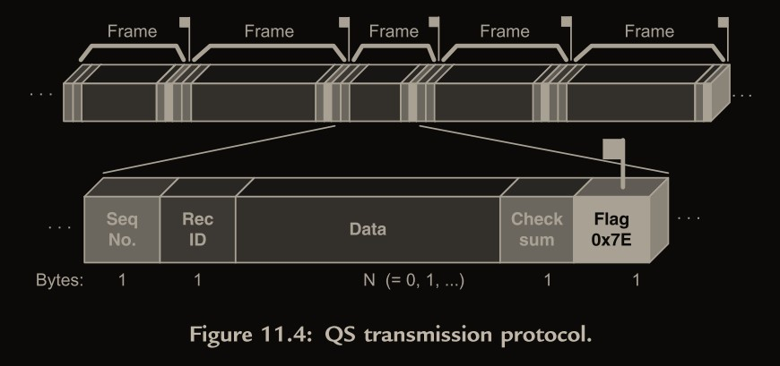
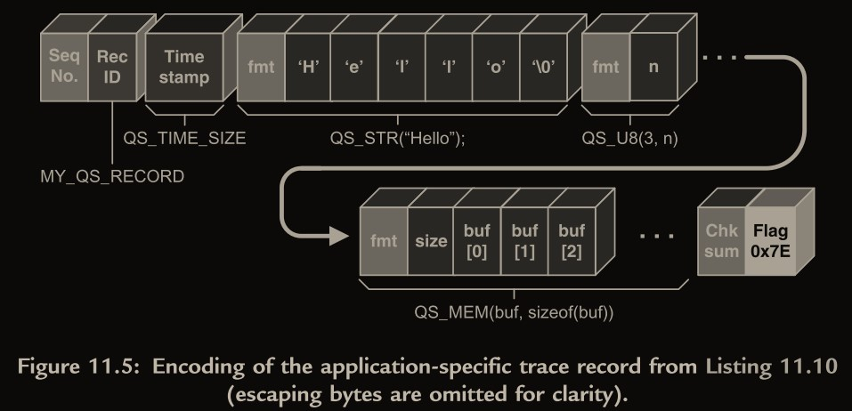

- [架构](#架构)
- [UML 状态图](#uml-状态图)
  - [状态机分类](#状态机分类)
  - [正交区域](#正交区域)
  - [转换的执行次序](#转换的执行次序)
  - [本地转换和外部转换的对比](#本地转换和外部转换的对比)
  - [UML 实例](#uml-实例)
  - [计算器设计实例](#计算器设计实例)
    - [高层设计](#高层设计)
    - [寻找重用 (Reuse)](#寻找重用-reuse)
    - [operandX 状态设计](#operandx-状态设计)
    - [处理负号的两种情况](#处理负号的两种情况)
    - [最终状态图](#最终状态图)
- [标准状态机的实现方法](#标准状态机的实现方法)
  - [嵌套的 switch 语句](#嵌套的-switch-语句)
  - [状态表 (State Table)](#状态表-state-table)
  - [面向对象的状态设计模式](#面向对象的状态设计模式)
    - [增加进入退出状态操作](#增加进入退出状态操作)
    - [封装事件处理](#封装事件处理)
  - [QEP FSM 实现方法](#qep-fsm-实现方法)
  - [状态机实现技术的一般性讨论](#状态机实现技术的一般性讨论)
- [层次式事件处理器的实现](#层次式事件处理器的实现)
  - [层次式状态处理函数](#层次式状态处理函数)
  - [层次式状态机的类](#层次式状态机的类)
    - [顶状态和初始伪状态](#顶状态和初始伪状态)
    - [进入 / 退出动作和嵌套的初始转换](#进入--退出动作和嵌套的初始转换)
    - [最顶层初始转换 (QHsm_init())](#最顶层初始转换-qhsm_init)
    - [分派事件（ QHsm_dispatch(), 通用结构）](#分派事件-qhsm_dispatch-通用结构)
    - [在状态机里实施一个转换（ QHsm_dispatch(), 转换）](#在状态机里实施一个转换-qhsm_dispatch-转换)
  - [使用 QEP 实现 HSM 步骤的概要](#使用-qep-实现-hsm-步骤的概要)
  - [常见问题](#常见问题)
- [实时框架的概念](#实时框架的概念)
  - [CPU 管理](#cpu-管理)
  - [活动对象计算模式](#活动对象计算模式)
    - [系统结构](#系统结构)
    - [异步通讯](#异步通讯)
    - [运行 - 到 - 完成 RTC](#运行---到---完成-rtc)
    - [封装](#封装)
  - [事件派发机制](#事件派发机制)
    - [直接事件发送](#直接事件发送)
    - [订阅派发机制](#订阅派发机制)
  - [事件内存管理](#事件内存管理)
    - [零复制的事件派发](#零复制的事件派发)
    - [静态和动态的事件](#静态和动态的事件)
    - [多路传输事件和引用计数器算法](#多路传输事件和引用计数器算法)
    - [事件的所有权](#事件的所有权)
    - [内存池](#内存池)
    - [时间管理](#时间管理)
    - [系统时钟节拍](#系统时钟节拍)
  - [错误和例外的处理](#错误和例外的处理)
- [实时框架的实现](#实时框架的实现)
- [移植和配置 QF](#移植和配置-qf)
  - [QP 平台抽象层](#qp-平台抽象层)
    - [生成 QP 应用程序](#生成-qp-应用程序)
    - [创建 QP 库](#创建-qp-库)
- [事件驱动型系统的软件追踪](#事件驱动型系统的软件追踪)
  - [QS 目标系统驻留构件](#qs-目标系统驻留构件)
    - [QS 源代码的组织](#qs-源代码的组织)
    - [QS 的平台无关头文件 qs.h 和 qs_dummy.h](#qs-的平台无关头文件-qsh-和-qs_dummyh)
    - [QS 的临界区](#qs-的临界区)
    - [QS 记录的一般结构](#qs-记录的一般结构)
    - [QS 的过滤器](#qs-的过滤器)
      - [全局开/关过滤器](#全局开关过滤器)
      - [本地过滤器](#本地过滤器)
    - [QS 数据协议](#qs-数据协议)
      - [透明](#透明)
      - [大小端](#大小端)
    - [QS 追踪缓存区](#qs-追踪缓存区)
      - [初始化 QS 追踪缓存区 QS_initBuf()](#初始化-qs-追踪缓存区-qs_initbuf)
    - [面向字节的接口： QS_getByte()](#面向字节的接口-qs_getbyte)
    - [面向块的接口： QS_getBlock()](#面向块的接口-qs_getblock)
    - [字典追踪记录](#字典追踪记录)
    - [应用程序相关的 QS 追踪记录](#应用程序相关的-qs-追踪记录)
    - [移植和配置 QS](#移植和配置-qs)
  - [QSPY 主机应用程序](#qspy-主机应用程序)
  - [向 MATLAB 输出追踪数据](#向-matlab-输出追踪数据)
  - [向 QP 应用程序添加 QS 软件追踪](#向-qp-应用程序添加-qs-软件追踪)
    - [定义平台相关的 QS 回调函数](#定义平台相关的-qs-回调函数)
    - [使用回调函数 QS_onGetTime() 产生 QS 时间戳](#使用回调函数-qs_ongettime-产生-qs-时间戳)
    - [](#)
- [问题](#问题)
- [参考](#参考)

## 架构


`QF` 是一个轻量级`实时框架`，是 `QP事件驱动平台`的核心构件， QP 也包括了 `QEP层次式事件处理器`（在本书第一部分描叙），可抢占的`RTC内核(QK)`，和`软件追踪装置(QS)`。

## UML 状态图

### 状态机分类

有限状态机 (FSM)
: 行为的改变（例如，响应`任何事件`的改变）对应着`状态改变`，被称为状态转换。

扩展状态机(ESM)
: 事件的发生并不意味着状态改变，通过`定量`的方式，让事件发生达到`一定条件`（如次数）才`改变状态`。

层次式状态机(HSM)
: 子状态没有对应事件处理方法时，寻找父状态处理方法

包含其他状态的状态被称为复合状态 (composite state) ，相对的，没有内部结构的状态被称为简单状态 (simple state)。一个嵌套的状态当它没有被其他状态包含时被称为直接子状态 (direct substate)，否则，它被归类于过渡性嵌套子状态 (transitively nested substate) 。

### 正交区域

算机键盘的两个正交区域（主键区和数字键区）。


当一个系统的行为被分解为独立的`并发性`的主动部分时，状态数目组合性增加，正交区域解决了这个常常碰到的问题。例如，除`主键区`外，一个计算机键盘有一个独立的`数字键区`。

尽管正交区域意味着执行时的`独立性`（也就是说有一些并发性）， UML 规范没有要求为每一个正交区域分配一个独立的执行线程（尽管可以这样做）。事实上最普通的情况是，这些正交区域在同一个线程里执行。 UML 规范仅要求设计者在一个事件被派发到一些相关的正交区域时，不要依赖于任何特定的次序。

### 转换的执行次序


在 UML ，一个`状态转换`能直接连接任何两个状态。这两个状态也许是复合的状态，它们被定名一个转换的`主源` (main source) 和`主目标` (main target)。图 2.9 展示了一个简单的转换实例，并解释了在这个转换里的状态的角色。 UML 规范描叙了执行一个状态转换需要牵涉到以下的动作 [OMG07, 15.3.13 节]:

1. 评估和转换联合的监护条件，如果监护条件为真则执行以下的步骤。
2. 退出源状态配置。
3. 执行和转换联合的动作。
4. 进入到目的状态配置。

在这个简单的实例里，主源和主目标在相同的层嵌套，因此这个转换序列很容易解释。例如，图 2.9 所示的转换 T1 引起监护条件 g() 的评估，假设监护条件 g( ) 被评估为真，后面是动作的执行序列： a( ) ； b( ) ； t( ) ； c( ) ； d( ) ； e( ) 。

**本书改动**：

本书描叙的 `HSM实现`（见第四章）通过进入到目标状态配置来维持必要的退出源结构的次序，但是完全在`源状态的上下文`里去执行和转换联合的动作。也就是说，在`退出`源状态配置`之前`执行。所实现的具体的转换序列如下：

1. 评估和转换联合的监护条件，仅当监护条件为真，执行以下的步骤。
2. 执行和转换联合的动作。
3. 退出源状态配置并进入到目标状态配置。

例如，图 2.9 所示的转换 T1 会引发对监护条件 g( ) 的评估；然后当对监护条件 g( ) 为真时是`动作序列`： t( ) ；a( ) ； b( ) ； c( ) ； d( ) ； e( ) 。

就是先进行转换和对应动作，再退出源状态，因为退出源状态意味着清空了上下文，不退出就可以利用`源状态的上下文`信息做些事情

### 本地转换和外部转换的对比


本地转换在主目标状态是`主源状态`的一个`子状态`时，并不会导致从主源状态的退出。

本地转换在主目标状态是`主源状态`的一个`超状态`时，不会导致退出和重新进入目标状态。

### UML 实例

对应 p74

假想的 `4 层嵌套状态机`，包含了所有可能的状态转换拓扑，初始 me->foo 为 0：


> **勘误**：s11 的 D 事件处理应该是内部转换，也就是不退出 s1，不然和后面的命令图对不上
> 

`状态切换`，QHSMTST.EXE 实例程序运行在命令窗口。 在括号里的是供参照的行序号：


- 如果状态里包含大黑点（初始伪状态 ）和无条件的箭头，表示会自动进入箭头指向的状态，但首先要执行该状态自带的 init，不论是否之前 EXIT 过或是 ENTER 过（见 2.3.12 伪状态 (Pseudostates)）

  - 如（5）中，因为要处理 D 退出到了 s 状态，此时就需要执行 s 状态自带的 init，再根据无条件箭头指向的 s11，先进入 s1 再是 s11

- 伪状态

  - 初始伪装态 (initial pseudostate)( 显示为一个黑点）
  - 选择伪装态 (choice pseudostate)( 显示为一个菱形或空心圈 )
  - 浅历史伪装态 (shallow-history pseudostate)
  - 深历史伪状态 (deep-history pseudostate)
  - 连接点伪装态 (junction pseudostate)
  - 结合伪装态 (join pseudostate)
  - 分支伪装态 (fork pseudostate)

- 事件的表示

  - 事件名称(类型)
  - (可选)菱形分割
  - 监护条件(判断条件，`[]`包裹)
  - 分割号`/`
  - 动作
  - 源状态(超状态有个黑点表示本状态，表示进入此状态时无条件自动进入目标状态，状态机不能处于超状态下)
  - 目标状态

  示例 1：`I[me->foo]/me->foo=0`，`I`为事件名称，`[me->foo]`为监护条件，分割号`/`分割了事件信息和动作，`me->foo=0`为动作。

  示例 2：`e/`，`e`表示 enter 事件，没有对应的动作和监护条件；`x/`，`x`表示 exit 事件，没有对应的动作和监护条件

- `满足监护条件`才会执行对应的`状态转换`和`动作`。

- 子状态之间的状态转换需要源状态依次退出到双方的`最小共同父状态`(如 s11 和 s211 的最小共同父状态为 s，书中叫最少共同祖先 least common ancestor(LCA)，我觉得不太好理解)，再依次进入到目的标态

### 计算器设计实例

计算器（见图 2.13）总的来说操作如下：用户输入一个操作数 (operand) ，然后一个操作符 (operator)，然后另一个操作数，最后点击等号按钮得到一个结果。从编程的角度看，意味着这个计算器需要对由下面 BNF 语法定义的数字表达式进行语法分析

```plaintext
expression ::= operand1 operator operand2 '='
operand1   ::= expression | ['+' | '-'] number
operand2   ::= ['+' | '-'] number
number     ::= {'0' | '1' | ... '9'}* ['.' {'0' | '1' | ... '9'}*]
operator   ::= '+' | '-' | '*' | '/'
```

#### 高层设计


(a)没有结果显示状态，(b)就可以在开始下一次输入 operand1 前清空屏幕，还可以将结果作为下一次的 operand1

> 把信号 PLUS ，MINUS， MULTIPLY 和 DIVIDE `合并`成一个高级的信号 `OPER` （操作数）。这个变换避免了在两个转换（从 operand1 到 opEntered，和从 result 到 opEntered）上重复相同的触发。

#### 寻找重用 (Reuse)


为了保证能在任意状态执行 Clear 初始化和关机，需要很多状态转换。

此时可以提取一个超状态，初始化操作和关机操作放到超状态，让子状态重用该操作

#### operandX 状态设计


三个入口：

- 输入 0 事件 -- zeroX 状态
- 输入 1-9 事件 -- intX 状态
- 输入小数点事件 -- fracX 状态

三个状态：

- zeroX

  - 忽略输入 0 事件
  - 其他事件产生状态切换

- intX

  - 处理输入 0-9 事件
  - 输入小数点事件产生状态切换

- fracX

  - 处理输入 0-9 事件
  - 忽略输入小数点事件

#### 处理负号的两种情况

如表达式 -2 \* -2 =


添加两个和 operandX 同级的状态 negated1 和 negated2 用于处理数字前的负号，和 zeroX 状态类似

#### 最终状态图


## 标准状态机的实现方法

定时炸弹状态机的 UML 状态图:


### 嵌套的 switch 语句

```c
void Bomb1_dispatch(Bomb1 *me, Event const *e) { /* dispatching */
  switch (me->state) {
    case SETTING_STATE: {
      switch (e->sig) {
        case UP_SIG: { /* internal transition with a guard */
        ...}
      }
      ...
    }
    case TIMING_STATE: {
      switch (e->sig) {
        case UP_SIG: {
          me->code <<= 1;
          me->code |= 1;
          break;
        }
        ...
      }
      ...
    }
    ...
  }
}
```

### 状态表 (State Table)


| 当前状态 | 事件 ( 参数 )   | [ 监护条件 ]             | 下一状态 | 动作                                    |
| :------- | :-------------- | :----------------------- | :------- | :-------------------------------------- |
| setting  | UP              | [me->timeout < 60]       | setting  | ++me->timeout;BSP_display(me->timeout); |
|          | DOWN            | [me->timeout > 1]        | setting  | --me->timeout;BSP_display(me->timeout); |
|          | ARM             |                          | timing   | me->code = 0;                           |
|          | TICK            |                          | setting  |                                         |
| timing   | UP              |                          | timing   | me->code <<=1;me->code = 1;             |
|          | DOWN            |                          | timing   | me->code <<= 1;                         |
|          | ARM             | [me->code == me->defuse] | setting  |                                         |
|          | TICK(fine_time) | [e->fine_time == 0]      | choice   | --me->timeout;BSP_display(me->timeout); |
|          |                 | [me->timeout == 0]       | final    | BSP_boom();                             |
|          |                 | [else]                   | timing   |                                         |

### 面向对象的状态设计模式


用到了多态，使用 C++实现更为简单

正常来说 BombState 被定义为`抽象类`，应该包含至少一个`纯虚函数`，不过此处没有，应该是为了让子类继承父类中虚函数的空实现。

#### 增加进入退出状态操作


Bomb 类的 onTick()操作不仅调用了 BombState 状态或是子状态的 onTick 事件处理，还检测了状态是否切换，并执行对应的退出和进入动作

#### 封装事件处理


封装了状态中的事件处理函数，这就导致需要在封装函数内使用`switch`区分事件并执行操作。

坏处是失去了 C++提供的多态性

好处是在添加新事件时只需修改函数内内容，无需增加函数定义

### QEP FSM 实现方法

在前面的几节里，提供了实现 FSM 的三种最流行的技术。可是从我的经验来说，单独使用它们时没有一个是最优的

本章只介绍 FSM 的实现，HSM 层次式状态机的在下一章

通用的 QEP 事件处理器：

QEP（事件处理器）设计的创新性来自于把`状态`直接映射成`状态处理函数`，处理在状态里它们表示的全部事件


```c
/* qevent.h ----------------------------------------------------------------*/
typedef struct QEventTag
{                     /* the event structure */
    // 一个整数，相当于事件唯一标识，方便switch...case...区分事件
    QSignal sig;      /* signal of the event */
    uint8_t dynamic_; /* dynamic attribute of the event (0 for static) */
} QEvent; // 事件，可派生添加参数

/* qep.h -------------------------------------------------------------------*/
// 事件处理对事件处理的状态
typedef uint8_t QState;          /* status returned from a state-handler function */
// 状态处理函数指针，本设计中状态处理函数就表示状态，有typedef表示指定它的类型为QState，
// 相当于一种声明，而非定义产生实例
typedef                          /* pointer to function type definition */
    QState                       /* return type */
    (*QStateHandler)             /* name of the pointer-to-function type */
    (void *me, QEvent const *e); /* argument list */ // 一个通用状态机的指针和一个 QEvent指针

typedef struct QFsmTag
{                        /* Finite State Machine */
    // 当前处于的状态，指向状态处理函数
    QStateHandler state; /* current active state */
} QFsm; // 派生各个状态机结构的基本类

#define QFsm_ctor(me_, initial_) ((me_)->state = (initial_))
// 触发状态机的初始转换
void QFsm_init(QFsm *me, QEvent const *e);
// 派发一个事件给状态机
void QFsm_dispatch(QFsm *me, QEvent const *e);

// 从状态处理函数到事件处理器的返回状态
#define Q_RET_HANDLED ((QState)0)
#define Q_RET_IGNORED ((QState)1)
#define Q_RET_TRAN ((QState)2)

// 一个状态处理函数，每当它处理了当前的事件时，返回宏 Q_HANDLED( ) 。
#define Q_HANDLED() (Q_RET_HANDLED)
// 一个状态处理函数，每当它忽略（不处理）当前的事件时，返回宏 Q_IGNORED( )
#define Q_IGNORED() (Q_RET_IGNORED)
// 逗号表达式表示执行逗号前语句，但整个表达式的值为逗号后变量，优先级比'='更低，
// 先执行((QFsm *)me)->state = (QStateHandler)(target_)，但Q_TRAN(target_)值为Q_RET_TRAN
// 这里可以用(QFsm *)强制转换me是因为派生类me的第一个成员变量就是它的父类QFsm实例，内存起始位置和me一样
#define Q_TRAN(target_) \
    (((QFsm *)me)->state = (QStateHandler)(target_), Q_RET_TRAN)

// 内部使用的信号
// QEP内部维护一个不变的保留事件数组 QEP_reservedEvt_[ ]。用于保存信号对应的事件
enum QReservedSignals
{
    Q_ENTRY_SIG = 1, /* signal for coding entry actions */
    Q_EXIT_SIG,      /* signal for coding exit actions */
    Q_INIT_SIG,      /* signal for coding initial transitions */
    Q_USER_SIG       /* first signal that can be used in user applications */
};
```

QEP FSM 事件处理器的实现:

```c
/* file qfsm_ini.c ---------------------------------------------------------*/
#include "qep_port.h" /* the port of the QEP event processor */
#include "qassert.h"  /* embedded systems-friendly assertions */
void QFsm_init(QFsm *me, QEvent const *e)
{
    // 执行QFsm超状态的状态处理函数，就是init
    (*me->state)(me, e); /* execute the top-most initial transition */
    // 进入目的状态，手动指定状态切换事件(用信号Q_ENTRY_SIG指定)，并处理状态切换事件
    // QEP内部维护一个不变的保留事件数组 QEP_reservedEvt_[ ]。用于保存信号对应的事件
    (void)(*me->state)(me, &QEP_reservedEvt_[Q_ENTRY_SIG]);/* enter the target */
}
/* file qfsm_dis.c ---------------------------------------------------------*/
// 事件生成函数
void QFsm_dispatch(QFsm *me, QEvent const *e)
{
    // 在栈空间中临时保存，防止执行事件处理函数切换状态后丢失源状态
    QStateHandler s = me->state; /* save the current state */
    // 调用当前状态中对应的事件处理函数
    QState r = (*s)(me, e);      /* call the event handler */
    if (r == Q_RET_TRAN) // 执行事件处理函数后发生了状态转换
    {                                                           /* transition taken? */
        // 退出源状态，调用源状态的事件处理函数（发送信号Q_EXIT_SIG）
        (void)(*s)(me, &QEP_reservedEvt_[Q_EXIT_SIG]);          /* exit the source */
        // 进入目的状态，调用目的状态的事件处理函数（发送信号Q_ENTRY_SIG）
        (void)(*me->state)(me, &QEP_reservedEvt_[Q_ENTRY_SIG]); /*enter target*/
    }
}
```

应用程序相关的代码(定时炸弹实例):

```c
#include "qep_port.h" /* the port of the QEP event processor */
#include "bsp.h"      /* board support package */
// 内部使用的信号
enum BombSignals
{ /* all signals for the Bomb FSM */
  UP_SIG = Q_USER_SIG,
  DOWN_SIG,
  ARM_SIG,
  TICK_SIG
};
// 继承自QEvent的Tick事件
typedef struct TickEvtTag
{
    QEvent super;      /* derive from the QEvent structure */
    uint8_t fine_time; /* the fine 1/10 s counter */
} TickEvt;
// 继承自QFsm的状态机，增加了自定义的一些参数
typedef struct Bomb4Tag
{
    QFsm super;      /* derive from QFsm */
    uint8_t timeout; /* number of seconds till explosion */ //倒计时
    uint8_t code;    /* currently entered code to disarm the bomb */ //密码输入值
    uint8_t defuse;  /* secret defuse code to disarm the bomb */ //密码
} Bomb4;
// 后面是不是就是检测到事件时调用me->state(me,e)就行
void Bomb4_ctor(Bomb4 *me, uint8_t defuse); // 初始化（类似C++的构造函数）
QState Bomb4_initial(Bomb4 *me, QEvent const *e); // 入口
QState Bomb4_setting(Bomb4 *me, QEvent const *e); // setting状态事件处理函数
QState Bomb4_timing(Bomb4 *me, QEvent const *e); // timing状态事件处理函数
/*--------------------------------------------------------------------------*/
/* the initial value of the timeout */
#define INIT_TIMEOUT 10
/*..........................................................................*/
void Bomb4_ctor(Bomb4 *me, uint8_t defuse)
{
    QFsm_ctor_(&me->super, (QStateHandler)&Bomb4_initial);
    me->defuse = defuse; /* the defuse code is assigned at instantiation */
}
/*..........................................................................*/
QState Bomb4_initial(Bomb4 *me, QEvent const *e)
{
    (void)e;
    me->timeout = INIT_TIMEOUT;
    return Q_TRAN(&Bomb4_setting); //切换到setting
}
/*..........................................................................*/
QState Bomb4_setting(Bomb4 *me, QEvent const *e)
{
    // 使用switch区分事件，这里是用了QEvent中的一个整数变量sig，相当于事件唯一标识，
    // 因为switch只支持int整数，不支持结构体
    switch (e->sig)
    {
    case UP_SIG:
    {
        if (me->timeout < 60)
        {
            ++me->timeout;
            BSP_display(me->timeout);
        }
        return Q_HANDLED();// 不切换状态就返回Q_HANDLED()
    }
    case DOWN_SIG:
    {
        if (me->timeout > 1)
        {
            --me->timeout;
            BSP_display(me->timeout);
        }
        return Q_HANDLED();
    }
    case ARM_SIG:
    {
        // 需要切换状态就使用Q_TRAN
        return Q_TRAN(&Bomb4_timing); /* transition to "timing" */
    }
    }
    return Q_IGNORED();// 没有对应事件就返回Q_IGNORED()
}
/*..........................................................................*/
void Bomb4_timing(Bomb4 *me, QEvent const *e)
{
    switch (e->sig)
    {
    case Q_ENTRY_SIG:
    {
        me->code = 0; /* clear the defuse code */
        return Q_HANDLED();
    }
    case UP_SIG:
    {
        me->code <<= 1;
        me->code |= 1;
        return Q_HANDLED();
    }
    case DOWN_SIG:
    {
        me->code <<= 1;
        return Q_HANDLED();
    }
    case ARM_SIG:
    {
        if (me->code == me->defuse)
        {
            return Q_TRAN(&Bomb4_setting);
        }
        return Q_HANDLED();
    }
    case TICK_SIG:
    {
        // 拿派生事件的自定义参数也没问题
        if (((TickEvt const *)e)->fine_time == 0)
        {
            --me->timeout;
            BSP_display(me->timeout);
            if (me->timeout == 0)
            {
                BSP_boom(); /* destroy the bomb */
            }
        }
        return Q_HANDLED();
    }
    }
    return Q_IGNORED();
}
```

### 状态机实现技术的一般性讨论

- `函数指针`是使用 C/C++ 实现状态机时最快的途径。状态函数可以放在 ROM 里，RAM 里只需存指针。
- C++语言里，`异常抛出和捕捉`例外和状态机的`运行到完成` (RTC) 语义基本上`不相容`。因为破坏了事件处理的原子性
- `监护条件`和`选择伪状态`的实现就是把`return Q_TRAN()`改为条件判断函数，将切换状态的任务交给该函数
- `QFsm_dispatch`实现状态切换的方式是发送`EXIT`和`ENTER`事件(信号)给对应状态，这样状态可以在进入和退出时做一些事情，如初始化某些值，相关状态只需要在事件处理函数中实现对这类事件的处理。

## 层次式事件处理器的实现


下面只介绍和 FSM 实现不同的地方

### 层次式状态处理函数

一个层次式状态处理函数`QStateHandler`必须特别通知事件处理器有关状态`嵌套层次`的信息。

当一个层次式状态处理函数不处理当前的事件，它返回一个宏 `Q_SUPER()`给事件处理器，定义如下:

```c
#define Q_RET_SUPER ((QState)3)
#define Q_SUPER(super_) \
  (((QHsm *)me)->state = (QStateHandler)(super_), Q_RET_SUPER)
```

FSM 里不处理是返回`Q_RET_IGNORED`，因为没有超状态去处理它，HSM 里就需要返回`Q_RET_SUPER`

```c
QState Calc_int1(Calc *me, QEvent const *e)
{
    switch (e->sig)
    {
    case DIGIT_0_SIG: /* intentionally fall through */
    case DIGIT_1_9_SIG:
    {
        BSP_insert(((CalcEvt const *)e)->key_code);
        return Q_HANDLED();
    }
    case POINT_SIG:
    {
        BSP_insert(((CalcEvt const *)e)->key_code);
        return Q_TRAN(&Calc_frac1);
    }
    }
    return Q_SUPER(&Calc_operand1);
}
```

### 层次式状态机的类

QHsm 类

**C 语言版本**：

```c
typedef struct QHsmTag
{
    QStateHandler state; /* current active state (state-variable) */
} QHsm; // 这里和FSM一样，事件处理函数的指针
#define QHsm_ctor(me_, initial_) ((me_)->state = (initial_))
void QHsm_init(QHsm *me, QEvent const *e);
// 分派事件
void QHsm_dispatch(QHsm *me, QEvent const *e);
// 测试HSM是否“在”一个给定的状态内，超状态包括子状态
uint8_t QHsm_isIn(QHsm *me, QHsmState state);
/**
 * 函数QHsm_top( )是顶状态的层次式状态处理函数。
 * 顶状态是 UML 的概念，表示状态层次的最终根。
 * 顶状态处理函数对每一个事件的处理方法是静静的忽略它，
 * 这是 UML 的默认方法
 */
QState QHsm_top(QHsm *me, QEvent const *e);
```

c 语言版本的不太直观，没有反应出继承关系，建议看 C++版本的

**C++版本**：

```cpp
class QHsm
{
protected:
    QStateHandler m_state; // current active state (state-variable)

public:
    void init(QEvent const *e = (QEvent const *)0);
    void dispatch(QEvent const *e);
    uint8_t isIn(QHsmState state);

protected:
    QHsm(QStateHandler initial) : m_state(initial) {} // protected ctor
    static QState top(QHsm *me, QEvent const *e);
};
```

其中`top`函数就是 C 版本中的`QHsm_top`，这里用了`静态类型`，这样子类继承后所有对象共享相同的 top 函数，也可以`防止被重载`。且 static 成员变量或函数在基类和派生类中是`共用空间`的，可以节省空间

除此之外的其他成员函数都是需要`重载`的

#### 顶状态和初始伪状态

每一个 HSM 都有（典型的是隐含）`顶状态` top，它围绕着整个状态机的全部其他元素


QHsm 类通过提供 `QHsm_top()` 层次式状态处理函数，然后由`子类`来继承它，从而确保顶状态对每一个`派生`的状态机都是可用的。 `QHsm_top()` 层次式状态处理函数定义如下：

```c
// protected型的静态成员函数，子类都可调用，一般在子类处理事件时如果没有找到对应处理方式时调用
QState QHsm_top(QHsm *me, QEvent const *e)
{
    // 避免编译器报未使用参数的警告，空引用一下
    (void)me;           /* avoid the compiler warning about unused parameter */
    (void)e;            /* avoid the compiler warning about unused parameter */
    // 顶状态可以理解为一个虚状态，不做任何事，所以忽略掉事件
    return Q_IGNORED(); /* the top state ignores all events */
}
```

状态机的初始化被特意分为 2 步。 QHsm `构造函数`仅仅把状态变量初始化成`初始伪状态`。然后，应用程序代码必须通过调用`QHsm_init()`明确的触发初始转换。这个设计分割了状态机的实例化和初始化，让用户程序对系统的初始化顺序有完全的控制。

下一节有详细描述

以下代码展示了计算器状态机的一个初始伪状态处理函数的例子：

```c
QState Calc_initial(Calc *me, QEvent const *e)
{
    (void)e;                 /* avoid the compiler warning about unused parameter */
    BSP_clear();             /* clear the calculator display */
    // 初始化后必须转换到默认子状态的操作
    return Q_TRAN(&Calc_on); /* designate the default state */
}
```

`非叶子`状态才有`初始伪状态`，离开状态再次进入会触发初始化

#### 进入 / 退出动作和嵌套的初始转换

```c
enum QReservedSignals {
    Q_ENTRY_SIG = 1, /* signal for coding entry actions */
    Q_EXIT_SIG, /* signal for coding exit actions */
    Q_INIT_SIG, /* signal for coding initial transitions */
    Q_USER_SIG /* first signal that can be used in user code */
};
```

状态处理函数能够通过把它们放在在 switch 语句的 case 后作为标签来处理它们。

状态处理函数可以任意执行任何动作去响应这些信号

限制条件：

- `进入动作Q_ENTRY_SIG`和`退出动作Q_EXIT_SIG`中不能做任何`状态转换`
- `初始化动作Q_INIT_SIG`必须包括 `Q_TRAN()` 宏来转换到当前状态的`默认子状态`。

嵌套的初始转换必须“钻进”状态层次(直接或间接的子状态)，但是不能“上升” 到目标超状态，或“绕道”到同级状态。

```c
QState Calc_on(Calc *me, QEvent const *e)
{
    switch (e->sig)
    {
        case Q_ENTRY_SIG:
        { /* entry action */
            BSP_message("on-ENTRY;");
            return Q_HANDLED();
        }
        case Q_EXIT_SIG:
        { /* exit action */
            BSP_message("on-EXIT;");
            return Q_HANDLED();
        }
        case Q_INIT_SIG:
        { /* nested initial transition */
            BSP_message("on-INIT;");
            // 初始化后必须转换到子状态
            return Q_TRAN(&Calc_ready);
        }
        case C_SIG:
        {
            BSP_clear();
            return Q_TRAN(&Calc_on);
        }
        case OFF_SIG:
        {
            return Q_TRAN(&Calc_final);
        }
    }
    // 无法处理时使用超状态处理
    return Q_SUPER(&QHsm_top);
}
```

`保留`的信号占用最低的信号值（ 0...3,进入退出和初始化），它们不能被`应用程序`使用。为了方便，公开的 HSM 接口包含了信号 `Q_USER_SIG` ，这是用户可以使用的`第一个信号值`。一个典型的定义应用程序级信号的方法是使用一个新的`枚举值`。这样 Q_USER_SIG 能被用于`偏移`全部新的枚举量

#### 最顶层初始转换 (QHsm_init())


1. 执行和最顶层转换关联的动作
2. 执行进入动作到达默认子状态 `on`
3. 执行由状态 `on` 定义的和`初始`转换关联的动作
4. 执行进入动作到达默认子状态 `ready`
5. 执行由状态 `ready` 定义的和`初始`转换关联的动作，进入 `begin`
6. 执行和状态 `begin` 关联的进入动作。在这一刻，转换已经完成，因为 `begin` 是没有嵌套的初始转换的`叶状态`。

树状继承结构的优势是从叶节点`返回`到上层节点(如 top)很容易，但从上层节点`进入`到指定的目的节点却很复杂，因为要`遍历`寻找叶节点的父节点

QEP 里的解决方法是使用一个临时的数组 `path[]` 记录从初始状态的目标状态开始的`退出路径`而不执行任何动作（见图 4.4 ）。通过使用保留的 `QEP_EMPTY_SIG_` 信号来调用状态处理函数，令每一个状态处理函数不执行任何动作就立刻返回超状态。返回的路径被保存在 path[] 数组。在到达当前的状态后， path[] 数组被回访，精确的沿着它被退出的`相反次序`进入目标状态

使用 path[] 数组沿着正确的次序进入目标状态配置:


```c
#define QEP_TRIG_(state_, sig_) \
    ((*(state_))(me, &QEP_reservedEvt_[sig_]))

#define QEP_EXIT_(state_) \
    if (QEP_TRIG_(state_, Q_EXIT_SIG) == Q_RET_HANDLED) { \
        /* QS software tracing instrumentation for state entry */\
    }

#define QEP_ENTER_(state_) \
    if (QEP_TRIG_(state_, Q_ENTRY_SIG) == Q_RET_HANDLED) { \
        /* QS software tracing instrumentation for state exit */\
    }
void QHsm_init(QHsm *me, QEvent const *e)
{
    QStateHandler t;
    /* the top-most initial transition must be taken */
    // 初始伪状态产生的初始转换（只改了state没有执行对应进入动作）
    Q_ALLEGE((*me->state)(me, e) == Q_RET_TRAN);
    // 临时保存源状态t（第一次为top）
    t = (QStateHandler)&QHsm_top; /* HSM starts in the top state */
    do
    { /* drill into the target... */
        QStateHandler path[QEP_MAX_NEST_DEPTH_];
        int8_t ip = (int8_t)0; /* transition entry path index */
        // 临时存下目的状态，同时作为路径起点，前面做过状态转换，me->state已经是目的状态了
        path[0] = me->state;   /* save the target of the initial transition */
        // 返回到超状态，利用QEP_EMPTY_SIG_信号
        (void)QEP_TRIG_(me->state, QEP_EMPTY_SIG_);
        // 直到回退到源状态t，这里都只是修改state没有触发进入退出动作
        while (me->state != t)
        {
            // 保存路径
            path[++ip] = me->state;
            // 不断返回超状态，直到到达源状态
            (void)QEP_TRIG_(me->state, QEP_EMPTY_SIG_);
        }
        // 路径记录完把状态恢复为目的状态(只改了state没有执行对应进入动作)
        me->state = path[0]; /* restore the target of the initial tran. */
                             /* entry path must not overflow */
        Q_ASSERT(ip < (int8_t)QEP_MAX_NEST_DEPTH_);
        do
        {/* retrace the entry path in reverse (desired) order... */
            // 反向遍历路径，从源状态一层层进入目的状态（处理ENTER信号）
            QEP_ENTER_(path[ip]); /* enter path[ip] */
        } while ((--ip) >= (int8_t)0);
        // 临时保存源状态t（就是本循环一开始的目的状态，在下个循环里就是源状态了）
        // 现在来看是等于me->state的，因为上面也给me->state赋值了
        t = path[0]; /* current state becomes the new source */
    // 如果本次循环抵达的目的状态不是叶状态，还要继续深入
    } while (QEP_TRIG_(t, Q_INIT_SIG) == Q_RET_TRAN);
    // 直到当前状态为叶状态
    me->state = t;
}
```

> QEP 内定义的断言宏：
>
> - Q_REQUIRE()，断言一个前置条件
> - Q_ENSURE() ，断言一个后置条件
> - Q_INVARIANT() ，断言一个不变量
> - Q_ASSERT() ，断言一个其他类型的一般性契约
> - Q_ALLEGE，断言一个一般性的契约，而且即使在编译时间断言被禁止了也评估当前的情况。

#### 分派事件（ QHsm_dispatch(), 通用结构）

```c
void QHsm_dispatch(QHsm *me, QEvent const *e)
{
    QStateHandler path[QEP_MAX_NEST_DEPTH_];
    QStateHandler s;// source源状态
    QStateHandler t;// target目的状态
    QState r;
    // 临时保存当前状态，后面作为源状态
    t = me->state; /* save the current state */
    // 执行对应状态事件处理函数，如果返回Q_RET_SUPER说明交给了超状态处理，
    // 此时继续执行，直到某个超状态处理了该事件
    do
    { /* process the event hierarchically... */
        s = me->state;
        r = (*s)(me, e); /* invoke state handler s */
    } while (r == Q_RET_SUPER);
    // 当需要转换状态时，源状态必须为处理该事件的状态，
    // 所以如果处理事件的状态为超状态而非当前状态，
    // 当前状态必须切换为该超状态，也就是返回到该超状态
    if (r == Q_RET_TRAN)
    {                             /* transition taken? */
        int8_t ip = (int8_t)(-1); /* transition entry path index */
        int8_t iq;                /* helper transition entry path index */
        // 路径0赋值为目的状态
        path[0] = me->state;      /* save the target of the transition */
        // 路径1赋值为源状态
        path[1] = t;
        // s状态就是实际处理了该事件的状态
        // s状态可能是源状态，也可能是源状态的某个超状态
        // 如果当前状态不为s状态时，当前状态退出直到s状态
        while (t != s)
        { /* exit current state to transition source s... */
            // 退出源状态
            if (QEP_TRIG_(t, Q_EXIT_SIG) == Q_RET_HANDLED)
            {                                       /*exit handled? */
                // 退出成功时返回到超状态
                (void)QEP_TRIG_(t, QEP_EMPTY_SIG_); /* find superstate of t */
            }
            // t赋值为该超状态
            t = me->state; /* me->state holds the superstate */
        }
        // 最后t==s，执行状态切换动作（下一节讲）
        ...
    }
    me->state = t; /* set new state or restore the current state */
}
```

对`if (r == Q_RET_TRAN)`的解释：当需要转换状态时，源状态必须为处理该事件的状态，所以如果处理事件的状态为超状态而非当前状态，当前状态必须切换为该超状态，也就是返回到该超状态


本图中 result 收到的 OPER 事件被交给 ready 处理，ready 对事件的处理需要转换状态到 opEntered，所以必须将当前状态转变为 ready，也就是退出 result(此时不触发 ready 的 init，可以不把这个操作理解成标准的状态切换，因为本身 ready 也是临时状态，马上要切换成其他状态了)，然后触发状态切换从 ready 到 opEntered

#### 在状态机里实施一个转换（ QHsm_dispatch(), 转换）

上一节是找路径，这一节是沿着路径做转换

在 HSM 里执行一个通用的`状态转换`，到目前为止是 QEP 实现的`最复杂`的部分。挑战是最快的找到源状态和目标状态的`最少共同祖先` (`LCA`) 状态。 (LCA 是同时源状态和目标状态的超状态里的最低层次的状态 ) 。

然后转换序列牵涉到所有状态的`退出`动作，向上到达`LCA`（但是`不退出 LCA`本身），然后是递归的进入到目标状态，然后使用初始转换“`钻入`”到目标状态配置，直到到达一个`叶状态`为止。


> h: 子状态到超状态的超状态

```c
/* NOTE: 上一节代码省略部分 */
// 路径0保存了目的状态，给t赋值，t等于me->state
t = path[0]; /* target of the transition */
// 如果源状态等于目的状态，相当于自转换，情况(a)适用
if (s == t)
{                   /* (a) check source==target (transition to self) */
    QEP_EXIT_(s)    /* exit the source */
    ip = (int8_t)0; /* enter the target */
}
else
{
    // t(等于当前状态me->state)退出到超状态
    // 使用t作为参数，会忽略me->state原有值，执行后强制赋值，
    // 如此处给空信号返回超状态，me->state强制赋值为t的超状态
    (void)QEP_TRIG_(t, QEP_EMPTY_SIG_); /* superstate of target */
    // 为t赋值当前状态（目的状态的超状态）
    t = me->state;
    // 情况(b)，目的状态的超状态为源状态，超状态进入子状态（源状态不用退出）
    if (s == t)
    {                   /* (b) check source==target->super */
        ip = (int8_t)0; /* enter the target */
    }
    else
    {
        // 退出到s的超状态，为me->state强制赋值
        (void)QEP_TRIG_(s, QEP_EMPTY_SIG_); /* superstate of src */
                                            /* (c) check source->super==target->super */
        // 情况(c)，源状态的超状态等于目的状态的超状态
        if (me->state == t)
        {
            QEP_EXIT_(s)    /* exit the source */
            ip = (int8_t)0; /* enter the target */
        }
        else
        {
            /* (d) check source->super==target */
            // 情况(d)，源超状态等于目的状态
            if (me->state == path[0])
            {
                QEP_EXIT_(s) /* exit the source */
            }
            else
            {                   /* (e) check rest of source==target->super->super..
                                 * and store the entry path along the way
                                 */
                iq = (int8_t)0; /* indicate that LCA not found */
                ip = (int8_t)1; /* enter target and its superstate */
                path[1] = t;    /* save the superstate of target */
                t = me->state;  /* save source->super */
                /* find target->super->super */
                r = QEP_TRIG_(path[1], QEP_EMPTY_SIG_);
                while (r == Q_RET_SUPER)
                {
                    path[++ip] = me->state; /* store the entry path */
                    if (me->state == s)
                    {                   /* is it the source? */
                        iq = (int8_t)1; /* indicate that LCA found */
                        /* entry path must not overflow */
                        Q_ASSERT(ip < (int8_t)QEP_MAX_NEST_DEPTH_);
                        --ip;              /* do not enter the source */
                        r = Q_RET_HANDLED; /* terminate the loop */
                    }
                    else
                    { /* it is not the source, keep going up */
                        r = QEP_TRIG_(me->state, QEP_EMPTY_SIG_);
                    }
                }
                if (iq == (int8_t)0)
                { /* the LCA not found yet? */
                    /* entry path must not overflow */
                    Q_ASSERT(ip < (int8_t)QEP_MAX_NEST_DEPTH_);
                    QEP_EXIT_(s) /* exit the source */
                    /* (f) check the rest of source->super
                     * == target->super->super...
                     */
                    iq = ip;
                    r = Q_RET_IGNORED; /* indicate LCA NOT found */
                    do
                    {
                        if (t == path[iq])
                        {                          /* is this the LCA? */
                            r = Q_RET_HANDLED;     /* indicate LCA found */
                            ip = (int8_t)(iq - 1); /*do not enter LCA*/
                            iq = (int8_t)(-1);     /* terminate the loop */
                        }
                        else
                        {
                            --iq; /* try lower superstate of target */
                        }
                    } while (iq >= (int8_t)0);
                    if (r != Q_RET_HANDLED)
                    { /* LCA not found yet? */
                        /* (g) check each source->super->...
                         * for each target->super...
                         */
                        r = Q_RET_IGNORED; /* keep looping */
                        do
                        {
                            /* exit t unhandled? */
                            if (QEP_TRIG_(t, Q_EXIT_SIG) == Q_RET_HANDLED)
                            {
                                (void)QEP_TRIG_(t, QEP_EMPTY_SIG_);
                            }
                            t = me->state; /* set to super of t */
                            iq = ip;
                            do
                            {
                                if (t == path[iq])
                                { /* is this LCA? */
                                    /* do not enter LCA */
                                    ip = (int8_t)(iq - 1);
                                    iq = (int8_t)(-1); /*break inner */
                                    r = Q_RET_HANDLED; /*break outer */
                                }
                                else
                                {
                                    --iq;
                                }
                            } while (iq >= (int8_t)0);
                        } while (r != Q_RET_HANDLED);
                    }
                }
            }
        }
    }
}
/* retrace the entry path in reverse (desired) order... */
for (; ip >= (int8_t)0; --ip)
{
    QEP_ENTER_(path[ip]) /* enter path[ip] */
}
t = path[0];   /* stick the target into register */
me->state = t; /* update the current state */
               /* drill into the target hierarchy... */
while (QEP_TRIG_(t, Q_INIT_SIG) == Q_RET_TRAN)
{
    ip = (int8_t)0;
    path[0] = me->state;
    (void)QEP_TRIG_(me->state, QEP_EMPTY_SIG_); /* find superstate */
    while (me->state != t)
    {
        path[++ip] = me->state;
        (void)QEP_TRIG_(me->state, QEP_EMPTY_SIG_); /*find superstate*/
    }
    me->state = path[0];
    /* entry path must not overflow */
    Q_ASSERT(ip < (int8_t)QEP_MAX_NEST_DEPTH_);
    do
    {                        /* retrace the entry path in reverse (correct) order... */
        QEP_ENTER_(path[ip]) /* enter path[ip] */
    } while ((--ip) >= (int8_t)0);
    t = path[0];
}
```

### 使用 QEP 实现 HSM 步骤的概要

计算器认识的按键是： 0 ， 1-9 ， . ， + ， - ， \* ， / ， = ， C 和 E(cancel entry CE) 。ESC 按键终止程序。其他别的按键会被忽略。

- 枚举信号，如 C， CE ， DIGIT_0 ， DIGIT_1_9 等待
- 定义事件，如`OPER_SIG`信号对应按下+ ， - ， \* ， / 的四个事件，事件参数在 key_code 变量中

  ```c
  struct CalcEvt : public QEvent {
    uint8_t key_code;
  };
  ```

- 派生特定的状态机

  ```c
  class Calc : public QHsm
  {
  private:
      double m_operand1;  // the value of operand 1 (extended state variable)
      uint8_t m_operator; // operator key entered (extended state variable)
  public:
      Calc() : QHsm((QStateHandler)&Calc::initial)
      { // ctor
      }

  protected:
      // 声明为静态,如果有扩展派生类也能共享
      static QState initial(Calc *me, QEvent const *e);   // initial pseudostate
      static QState on(Calc *me, QEvent const *e);        // state handler
      static QState error(Calc *me, QEvent const *e);     // state handler
      static QState ready(Calc *me, QEvent const *e);     // state handler
      static QState result(Calc *me, QEvent const *e);    // state handler
      static QState begin(Calc *me, QEvent const *e);     // state handler
      static QState negated1(Calc *me, QEvent const *e);  // state handler
      static QState operand1(Calc *me, QEvent const *e);  // state handler
      static QState zero1(Calc *me, QEvent const *e);     // state handler
      static QState int1(Calc *me, QEvent const *e);      // state handler
      static QState frac1(Calc *me, QEvent const *e);     // state handler
      static QState opEntered(Calc *me, QEvent const *e); // state handler
      static QState negated2(Calc *me, QEvent const *e);  // state handler
      static QState operand2(Calc *me, QEvent const *e);  // state handler
      static QState zero2(Calc *me, QEvent const *e);     // state handler
      static QState int2(Calc *me, QEvent const *e);      // state handler
      static QState frac2(Calc *me, QEvent const *e);     // state handler
      static QState final(Calc *me, QEvent const *e);     // state handler
  };
  ```

- 定义初始伪状态，作用是执行一些初始化操作，还有转换到默认状态 on

  ```c
  QState Calc::initial(Calc *me, QEvent const * /* e */)
  {
      BSP_clear();
      return Q_TRAN(&Calc::on);
  }
  ```

- 定义状态处理函数

  用 switch 处理信号，避免`switch外`的处理代码

  - Q_ENTRY_SIG 和 Q_EXIT_SIG：进入动作和退出动作，总是返回 Q_HANDLED()，`不允许`状态切换
  - Q_INIT_SIG：每个`组合状态`（带有子状态的状态）能有它自己的`初始转换`，初始转换不能有监护条件，初始转换只能以自己的子状态作为目的状态
  - 内部转换：内部转换是对事件的简单反应，并从`不导致`状态的转换，因此也从不导致进入动作，退出动作或初始转换的执行，总是返回 Q_HANDLED()
  - 常规转换：执行动作，返回 Q_TRAN()
  - 监护条件：根据事件参数的值和 / 或和状态机联合的变量（扩展状态变量）来`动态的评估`。条件为 false 相当于没处理，需要抛给超状态处理

### 常见问题

- 不完整的状态处理函数

  ```c
  QState Calc_on(Calc *me, QEvent const *e)
  {
      switch (e->sig)
      {
          ...case C_SIG:
          {
              // case里应该return一个预定义的QState值，如Q_HANDLED()，
              // 这里却是一个自定义函数，虽然结果相同，但代码不直观，违反了设计规范
              return Calc_onClear(me); /* handle the Clear event */
          }
          ...
      }
      return Q_SUPER(&QHsm_top);
  }
  ...QState Calc_onClear(Calc *me)
  {
      BSP_clear();
      return Q_TRAN(&Calc_on); /* transition to "on" */
  }
  ```

- 在进入 / 退出动作或初始转换内访问事件参数

  处理 Q_ENTRY_SIG 信号时不应该访问 QEvent 参数，需要在切换时传递的参数可以定义为该状态机的全局变量（如上面的`m_operand1`），这样状态机里所有状态都能共享

- 不够优化的信号粒度

  计算器状态图把数字 1 到 9 的群表示为一个 信号 `IDC_1_9_SIG`，而不是每个数字一个信号，这样增加了一步读取事件参数获得实际值的操作，但减少了信号数量，总体上增大了信号粒度，避免过细的信号粒度带来的复杂性

  过大的信号粒度会导致一个 case 里写的条件判断过多（switch 套 switch），让代码变成意大利面条

## 实时框架的概念

### CPU 管理

传统的事件驱动型架构对实时框架不是非常适合。最起码在三个方面存在问题：

1. **响应性**：单一事件队列不允许对工作的任何合理的`优先次序`。每个事件，无论优先级，必
   须等待直到它前面的全部事件被处理完后才能被处理。
2. **不支持对应用程序上下文的管理**：流行的`事件 - 动作范型`在响应事件时忽略应用程序的
   上下文，这样应用程序员就即兴发挥，到最后搞出“面条”代码。不幸的是，事件 - 动作
   范型和状态机不兼容。
3. **全局数据**：在传统的事件架构里，全部的事件处理函数存取一样的全局数据。这阻碍了对问
   题的`分区`，并为任何形式的多任务带来了`并发性`危机。

### 活动对象计算模式


**活动对象** = （控制的线程 + 事件队列 + 状态机）

应用程序包含了多个`活动对象`，每个都封装了一个`控制线程（事件循环）`，一个私有的`事件队列`和一个`状态机`。

- `控制线程（事件循环）`: 图(a)中为一个环形标记，具体见图(b)，事件循环调用和这个活动对象联合的 dispatch()函数。 dispatch()函数执行调度和处理事件的工作， 类似于在传统事件驱动型架构的事件处理函数。
- `事件队列`：(a)中的 event queue
- `状态机`：(a)中的 internal state machine

#### 系统结构


`RTOS` 层在底部提供多任务和基本服务，比如`消息队列`，为存储事件确定内存分区等等。基于这些服务， `QF` 实时框架提供 `QActive` 类用于活动对象的`派生`。 `QActive` 类是从 QHsm 基础类派生而来，这意味着活动对象是状态机，并且继承了在 QHsm 基础类（见第四章）定义的`dispatch()`操作。另外， `QActive` 包含了一个`执行线程`和一个`事件队列`，它基于底层 RTOS 上的消息队列。应用程序通过从 QActive 基础类派生`活动对象`以及从 QEvent 类派生带有参数的`事件`，从而扩展了实时框架。

#### 异步通讯

活动对象专门的通过它们的`事件队列`接收事件。所以事件都被`异步`投递，意味着一个事件生产者仅发送一个事件给接收者活动对象的事件队列，但是`不会原地等待`这个事件的实际处理过程。

活动对象之间也可以通过这种方式传递事件，而不只局限于内部。

#### 运行 - 到 - 完成 RTC

每一个活动对象用运行到完成（ run-to-completion）方式来处理事件，它是通过活动对象的事件循环的结构来保证的。

#### 封装

封装意味着活动对象 不共享数据和任何其他资源。

数据通过消息机制传递

### 事件派发机制

两类事件派发机制:

- `简单的事件直接发送机制`：一个事件的生产者直接发送这个事件到消费者活动对象的`事件队列`。
- `订阅派发机制`，这里一个生产者“发行”一个事件给框架，框架然后把这个事件派发给所有已经“`订阅`”了这个事件的活动对象。发行-订阅机制提供了在事件产生者和消费者之间较低的耦合。

#### 直接事件发送

例如，QF 实时框架提供了操作 QActive_postFIFO()

这个事件传递的方式需要事件产生者密切的“`知道`”接收者。这种知识，散布在参与应用程序的组件中，使组件之间的`耦合`非常强烈和在运行时不灵活。

#### 订阅派发机制

- 事件的产生者和消费者不需要互相了解对方（`松耦合`）。
- 通过这个机制的事件交换必须被公开的了解，全部参与者必须有`相同的语义`。
- 需要一个`介质`去接收所发行的事件，再把它们派发给感兴趣的订阅者。
- `多对多`交互作用（对象-到-对象）被`一对多`交互作用（对象-到-介质）所取代

### 事件内存管理

事件频繁产生消耗，内存重用很重要

#### 零复制的事件派发

`复制`整个事件到消息队列的蛮力方法是一个传统的 RTOS 能做的最好方法，因为一个 RTOS 在事件离开队列后`不能够控制`它们。另一方面，一个`实时框架`可以更加有效，因为由于控制的倒置，框架实际在管理一个事件的全部`生命周期`。


一个事件的生命周期开始于框架分配`事件内存`并返回一个指向这个内存的`指针`给事件生产者，如图(1)，生产者然后`填充`事件`参数`，执行写入所提供的事件指针。然后，事件生产者发送这个事件`指针`给接收者活动对象的`队列`，如图(2)

稍后，活动对象开始`处理`事件。活动对象读取通过指针从队列里`提取`的事件数据。最后，框架在垃圾收集步骤自动的`回收`事件。请注意**事件从来没有被复制**。同时框架确信事件没有被过早回收。当然，框架必须也保证用一个`线程安全`的方式执行全部操作。

#### 静态和动态的事件

- **静态事件**：没有参数或参数不会变的事件，可以静态分配，永远不变，如上图(3)
- **动态事件**：参数会变的事件，需要事件池动态分配

#### 多路传输事件和引用计数器算法

使用订阅分发机制时也可以使用`零复制`派发事件指针。但该指针被`多个`活动对象使用，问题是如何知道`最后一个`活动对象完成了对这个给定事件的处理，这样它占用的空间可以被`回收`。

一个简便的方法是使用标准的`引用计数器算法`，每个动态事件有个计数器，开始为 0，每次发生事件加 1，每次被回收时减 1，到 0 删除事件内存

#### 事件的所有权


`生产者`仅能通过调用 `new_()` 操作来获得一个新事件的所有权。但是最后生产者必须把所有权`转让`给框架，如生产者发送或发行事件，主动要求删除不完整事件

`消费者`活动对象在`框架`调用 `dispatch(e)` 操作时获得当前事件 e 的所有权(只读)。当 dispatch()操作返回到框架时，所有权被终止。

#### 内存池

`堆`一般有碎片化、泄露、悬空指针、难以预测、无法重入、空间浪费（管理信息）等问题

内存池会有一定优势，QF 实时框架，可以管理多达 3 个拥有不同块尺寸（小，中，大）的事件池。

#### 时间管理


当活动对象需要安排一个超时服务，它准备它的某个`时间事件`以便在未来的某时刻发送给自己。

时间事件为这个目的提供的公共操作：为`一次性`超时提供`postIn()`，为`周期性`超时提供 `postEvery()` 。

应用程序可以明确的使用 `disarm()` 操作在任何时刻`解除` (disarm) 任何（周期性的或一次性的）时间事件，之后该事件空间可以`重用`。

可以通过 `rearm()` 操作`重新设定` (rearmed)，如刷新看门狗

#### 系统时钟节拍

系统时钟节拍典型地是一个以预先确定的速率发生的`周期性中断`，典型的速率在 10 和 100Hz 之间。

下图用某种夸张的方式展示了在一个节拍间隔内一个周期性时间事件的不同的延迟：


高优先级的任务能更及时获得节拍，且跳动(jitter)较少。

一个仅为了一个节拍而准备的时间事件会立刻过期，比如上图第 3 个节拍处理时已经在第 4 个节拍之后了，因为还在处理第 3 个节拍对应的的事件动作，可能会导致第 4 个节拍事件`没有产生`(类似中断丢失)，导致第 4 个节拍对应的动作无法执行。解决方法是事件要对应两个节拍，也就是原来指定第 4 个节拍发生的动作应该指定为 4 和 5 都能发生。

### 错误和例外的处理

契约式设计 Design by Contract, DbC 方法
: 通过`断言assertion`来保证程序正常，它们既`不预防`错误也实际上`不处理`错误

防御式编程
: 通过接收`更宽范围`的输入或允许操作的次序不必定符合对象的状态，让操作对错误更加`强壮`。

QF 框架规定了一些`断言宏`来处理错误

## 实时框架的实现

QF 框架的代码实现详解，对上一章的补充

TODO：还未看

## 移植和配置 QF

QF 包含了一个被清楚定义的`平台抽象层 PAL`（ platform abstraction layer ），它封装了所有平台相关的代码，清晰把它和平台无关的代码区分开

### QP 平台抽象层

#### 生成 QP 应用程序

你在使用的 QP 移植由 `qf_port.h` 头文件和 `QF 库文件`所在的目录分支决定。


编译+链接，QP 库允许连接器在链接时消除任何没有被引用的 QP 代码

#### 创建 QP 库

## 事件驱动型系统的软件追踪


上图展示了软件追踪的一个典型设置

嵌入式目标系统在运行被监测的代码，它在目标系统的 RAM 缓存区记录追踪数据。追踪数据通过一个数据连接被从这个缓存区送给一个主机，它存储、显示和分析这些信息。这个配置意味着软件追踪总是需要 2 个构件：

- 用来收集和发送追踪数据的[目标系统驻留构件](#qs-目标系统驻留构件)
- 用来接收，解压，可视化和分析这些数据的[主机驻留构件](#qspy-主机应用程序)。

### QS 目标系统驻留构件


- 侵入性小 - 数据格式化工作被从目标系统里移到主机执行
- 数据记录和发送数据给主机是分隔的，例如在目标 CPU 的空闲循环处传输数据。减少了发送数据的开销
- 支持数据压缩，如数据字典
- 带级别过滤器
- 带可配精度时间戳
- 探测传输错误并重传机制（高级数据连接控制协议 [High Level Data Link Control, HLDLC]）
- 轻量级传输API

#### QS 源代码的组织

```console
<qp>\qpc\ - QP/C root directory (<qp>\qpcpp for QP/C++)
    |
    +-include/ - QP platform-independent header files
    | +-qs.h - QS platform-independent active interface
    | +-qs_dummy.h - QS platform-independent inactive interface
    |
    +-qs/ - QS target component
    | +-source/ - QS platform-independent source code (*.C files)
    | | +-qs_pkg.h - internal, packet-scope interface for QS implementation
    | | +-qs.c - internal ring buffer and formatted output functions
    | | +-qs_.c - definition of basic unformatted output functions
    | | +-qs_blk.c - definition of block-oriented interface QS_getBlock()
    | | +-qs_byte.c - definition of byte-oriented interface QS_getByte()
    | | +-qs_f32.c - definition of 32-bit floating point output QS_f32()
    | | +-qs_f64.c - definition of 64-bit floating point output QS_f64()
    | | +-qs_mem.c - definition of memory-block output
    | | +-qs_str.c - definition of zero-terminated string output
    |
    +-ports\ - Platform-specific QP ports
    | +- . . .
    +-examples\ - Platform-specific QP examples
    | +- . . .<qp>\qpc\ - QP/C root directory (<qp>\qpcpp for QP/C++)
    |
    +-include/ - QP platform-independent header files
    | +-qs.h - QS platform-independent active interface
    | +-qs_dummy.h - QS platform-independent inactive interface
    |
    +-qs/ - QS target component
    | +-source/ - QS platform-independent source code (*.C files)
    | | +-qs_pkg.h - internal, packet-scope interface for QS implementation
    | | +-qs.c - internal ring buffer and formatted output functions
    | | +-qs_.c - definition of basic unformatted output functions
    | | +-qs_blk.c - definition of block-oriented interface QS_getBlock()
    | | +-qs_byte.c - definition of byte-oriented interface QS_getByte()
    | | +-qs_f32.c - definition of 32-bit floating point output QS_f32()
    | | +-qs_f64.c - definition of 64-bit floating point output QS_f64()
    | | +-qs_mem.c - definition of memory-block output
    | | +-qs_str.c - definition of zero-terminated string output
    |
    +-ports\ - Platform-specific QP ports
    | +- . . .
    +-examples\ - Platform-specific QP examples
    | +- . . .
```

QS 源文件通常在`每个文件`里只包含**一个函数**或**一个数据结构**。这种设计的目的在于把 QS 部署成一个`精细粒度`的库，你可以把它静态的和里的应用程序链接。精细粒度意味着 QS 库由许多小的松散耦合的模块（目标文件）组成，而不是由一个包含所有功能的单一模块组成。

#### QS 的平台无关头文件 qs.h 和 qs_dummy.h

- `qs.h` - QS 功能的所有“活动”接口
- `qs_dummy.h` - QS 功能的所有“不活动”接口

*qs.h*:

```c
#ifndef qs_h
#define qs_h
#ifndef Q_SPY
#error "Q_SPY must be defined to include qs.h"
#endif /* Q_SPY */

// 枚举QS记录类型，相当于日志标记
enum QSpyRecords
{
    /* QEP records */
    QS_QEP_STATE_ENTRY, /**< a state was entered */
    QS_QEP_STATE_EXIT,  /**< a state was exited */
    ...
    /* QF records */
    QS_QF_ACTIVE_ADD,         /**< an AO has been added to QF (started) */
    QS_QF_ACTIVE_REMOVE,      /**< an AO has been removed from QF (stopped) */
    QS_QF_ACTIVE_SUBSCRIBE,   /**< an AO subscribed to an event */
    QS_QF_ACTIVE_UNSUBSCRIBE, /**< an AO unsubscribed to an event */
    QS_QF_ACTIVE_POST_FIFO,   /**< an event was posted (FIFO) directly to AO */
    ...
    /* QK records */
    QS_QK_MUTEX_LOCK,   /**< the QK mutex was locked */
    QS_QK_MUTEX_UNLOCK, /**< the QK mutex was unlocked */
    QS_QK_SCHEDULE,     /**< the QK scheduled a new task to execute */
    ...
    /* Miscellaneous QS records */
    QS_SIG_DICTIONARY, /**< signal dictionary entry */
    QS_OBJ_DICTIONARY, /**< object dictionary entry */
    QS_FUN_DICTIONARY, /**< function dictionary entry */
    QS_ASSERT,         /** assertion failed */
    ...
    /* User records */
    QS_USER /**< the first record available for user QS records */
    // 从QS_USER开始可以自定义记录类型
};
...
/* Macros for adding QS instrumentation to the client code .................*/
//所有 QS 服务被定义为预处理器的宏。这样，即使软件追踪被禁止，你也可以把它们留在代码中。
#define QS_INIT(arg_) QS_onStartup(arg_)
#define QS_EXIT() QS_onCleanup()
// 全局 QS 过滤器，它把某个给定 QS 追踪记录打开或关闭。
#define QS_FILTER_ON(rec_) QS_filterOn(rec_)
#define QS_FILTER_OFF(rec_) QS_filterOff(rec_)
// 本地 QS 过滤器。这个过滤器允许你有选择的追踪那些特定的状态机对象。
#define QS_FILTER_SM_OBJ(obj_) (QS_smObj_ = (obj_))
#define QS_FILTER_AO_OBJ(obj_) (QS_aoObj_ = (obj_))
#define QS_FILTER_MP_OBJ(obj_) (QS_mpObj_ = (obj_))
#define QS_FILTER_EQ_OBJ(obj_) (QS_eqObj_ = (obj_))
#define QS_FILTER_TE_OBJ(obj_) (QS_teObj_ = (obj_))
#define QS_FILTER_AP_OBJ(obj_) (QS_apObj_ = (obj_))
/* Macros to generate user QS records (formatted data output) ..............*/
// 互斥锁，BEGIN上锁，END解锁，用于保护QS 追踪缓存
#define QS_BEGIN(rec_, obj_) ...
#define QS_END() ...
// 不上锁（比如在临界区内再调用就不需要关中断了）
#define QS_BEGIN_NOLOCK(rec_, obj_) ...
#define QS_END_NOLOCK() ...
    ...
#define QS_I8 (w_, d_) QS_u8((uint8_t)(((w_) << 4)) | QS_I8_T, (d_))
#define QS_U8 (w_, d_) QS_u8((uint8_t)(((w_) << 4)) | QS_U8_T, (d_))
#define QS_I16(w_, d_) QS_u16((uint8_t)(((w_) << 4)) | QS_I16_T, (d_))
#define QS_U16(w_, d_) QS_u16((uint8_t)(((w_) << 4)) | QS_U16_T, (d_))
#define QS_I32(w_, d_) QS_u32((uint8_t)(((w_) << 4)) | QS_I32_T, (d_))
#define QS_U32(w_, d_) QS_u32((uint8_t)(((w_) << 4)) | QS_U32_T, (d_))
#define QS_F32(w_, d_) QS_f32((uint8_t)(((w_) << 4)) | QS_F32_T, (d_))
#define QS_F64(w_, d_) QS_f64((uint8_t)(((w_) << 4)) | QS_F64_T, (d_))
#define QS_STR(str_) QS_str(str_)
#define QS_STR_ROM(str_) QS_str_ROM(str_)
#define QS_MEM(mem_, size_) QS_mem((mem_), (size_))
#if (QS_OBJ_PTR_SIZE == 1)
#define QS_OBJ(obj_) QS_u8(QS_OBJ_T, (uint8_t)(obj_))
#elif (QS_OBJ_PTR_SIZE == 2)
#define QS_OBJ(obj_) QS_u16(QS_OBJ_T, (uint16_t)(obj_))
#elif (QS_OBJ_PTR_SIZE == 4)
#define QS_OBJ(obj_) QS_u32(QS_OBJ_T, (uint32_t)(obj_))
#else
#define QS_OBJ(obj_) QS_u32(QS_OBJ_T, (uint32_t)(obj_))
#endif
#if (QS_FUN_PTR_SIZE == 1)
#define QS_FUN(fun_) QS_u8(QS_FUN_T, (uint8_t)(fun_))
#elif (QS_FUN_PTR_SIZE == 2)
    ...
#endif
#if (Q_SIGNAL_SIZE == 1)
#define QS_SIG(sig_, obj_)   \
    QS_u8(QS_SIG_T, (sig_)); \
    QS_OBJ_(obj_)
#elif (Q_SIGNAL_SIZE == 2)
    ...
#endif
/* Dictionary records ......................................................*/
#define QS_OBJ_DICTIONARY(obj_) ...
#define QS_FUN_DICTIONARY(fun_) ...
#define QS_SIG_DICTIONARY(sig_, obj_) ...
    ...
/* Macros used only internally in the QP code ..............................*/
#define QS_BEGIN_(rec_, obj_) ...
#define QS_END_() ...
#define QS_BEGIN_NOLOCK_(rec_, obj_) ...
#define QS_END_NOLOCK_() ...
/* QS functions for managing the QS trace buffer ...........................*/
void
QS_initBuf(uint8_t sto[], uint32_t stoSize);
uint16_t QS_getByte(void);                     /* byte-oriented interface */
uint8_t const *QS_getBlock(uint16_t *pNbytes); /* block-oriented interface */
/* QS callback functions, typically implemented in the BSP .................*/
uint8_t QS_onStartup(void const *arg);
void QS_onCleanup(void);
void QS_onFlush(void);
QSTimeCtr QS_onGetTime(void);
#endif /* qs_h */
```

*qs_dummy.h*:

```c
#ifndef qs_dummy_h
#define qs_dummy_h
#ifdef Q_SPY
#error "Q_SPY must NOT be defined to include qs_dummy.h"
#endif
#define QS_INIT(arg_) ((uint8_t)1)
#define QS_EXIT() ((void)0)
#define QS_DUMP() ((void)0)
#define QS_FILTER_ON(rec_) ((void)0)
#define QS_FILTER_OFF(rec_) ((void)0)
#define QS_FILTER_SM_OBJ(obj_) ((void)0)
...
#define QS_GET_BYTE(pByte_) ((uint16_t)0xFFFF)
#define QS_GET_BLOCK(pSize_) ((uint8_t *)0)
#define QS_BEGIN(rec_, obj_) \
    if (0)                   \
    {
#define QS_END() }
#define QS_BEGIN_NOLOCK(rec_, obj_) QS_BEGIN(rec_, obj_)
#define QS_END_NOLOCK() QS_END()
#define QS_I8(width_, data_) ((void)0)
#define QS_U8(width_, data_) ((void)0)
    ...
#define QS_SIG(sig_, obj_) ((void)0)
#define QS_OBJ(obj_) ((void)0)
#define QS_FUN(fun_) ((void)0)
#define QS_SIG_DICTIONARY(sig_, obj_) ((void)0)
#define QS_OBJ_DICTIONARY(obj_) ((void)0)
#define QS_FUN_DICTIONARY(fun_) ((void)0)
#define QS_FLUSH() ((void)0)
    ...
#endif
```

#### QS 的临界区

QS 目标构件必须保护`追踪缓存`的内部完整性，它在并发运行的任务和中断之间被共享，所以需要被视为`临界区`

当 QS 探测 `QF 临界区`的宏 QF_INT_LOCK() ， QF_INT_UNLOCK() 被定义时， QS 使用了**这个定义**作为它自己的临界区。

然而，当你在**没有** QF 实时框架的情况下使用 QS 时，你需要在`qs_port.h`头文件里定义 QS 的`平台相关`的中断上锁 / 解锁策略

> QS_BEGIN和QS_END()就是利用的`qs_port.h`里定义的锁宏

自定义的锁*qs_port.h*:

```c
#define QS_INT_KEY_TYPE . . .
    #define QS_INT_LOCK(key_) . . .
    #define QS_INT_UNLOCK(key_) . . .
```

#### QS 记录的一般结构

QS 在分离的被称为 `QS“追踪记录”` 的小块里记录追踪数据。

```c
QS_BEGIN_xxx(record_type) /* trace record begin */
    QS_yyy(data); /* QS data element */
    QS_zzz(data); /* QS data element */
    . . . /* QS data element */
QS_END_xxx() /* trace record end */
```

- `QS_BEGIN/QS_END()`: 在记录的开始处`上锁`中断，在记录的结尾`解锁`中断。
- `QS_BEGIN_NOLOCK()/QS_END_NOLOCK()`: 用来创建应用程序相关的记录而`不需进入`临界区，它们仅能被用于某个`临界区内部`。

> TODO:NOLOCK有什么意义

#### QS 的过滤器

##### 全局开/关过滤器

预定义的类型就是`qs.h`中的`QSpyRecords`枚举型，通过过滤器启用/禁用对应类型的日志记录

全局开 / 关过滤器使用一个位掩码数据`QS_glbFilter_[]`而高效的实现，这个数组的`每一位`代表一个追踪记录。当前 QS_glbFilter_[]包含 32字节，总共 32×8位可以代表 `256` 个不同的追踪记录。其中大约四分之一已经被用于预定义的 QP 追踪记录。剩下四分之三可以用于应用程序。

```c
#define QS_BEGIN(rec_, obj_) \
    if (((QS_glbFilter_[(uint8_t)(rec_) >> 3U] \
        & (1U << ((uint8_t)(rec_) & 7U))) != 0) . . .\
```

`rec_`表示记录类型枚举id，从0到255，右移三位表示整除8，因为最后三位被右移掉了，相当于把余数抹除了。这样`QS_glbFilter_[]`就能定位到该id对应的字节,如255对应第32个字节，46对应第5个字节。然后再以上一步余数（和7进行与操作）为`mask`找到对应的位，代码中就是将1左移余数值生成一个字节8位里的某个mask。如46余数是6，1左移6位，mask就是0x40，找到第5个字节中的0x40 mask对应的位

> 上述表达式中需要重复计算的部分可以作为编译时常数值。 如(QS_glbFilter_[5] & 0x40) != 0)

> 这里将QS_glbFilter_定义为单字节数组而不是多字节数组是为了兼容性。

- 宏`QS_FILTER_ON(rec_)`: 打开和记录 rec_ 对应的位
- 宏`QS_FILTER_OFF(rec_)`: 关闭和记录 rec_ 相对应的位

##### 本地过滤器

以对象为单位管理过滤器。如只开启对某个活动对象的打印，关闭其他的

对象类型有：状态机、活动对象、内存池、事件队列、时间事件、一般的应用程序对象

#### QS 数据协议

类似HDLC协议

QS 协议被特别设计用来简化在目标系统里的数据管理的开销，同时允许探测到任何由于追踪缓存不足造成的`数据丢失`。这个协议不但可以探测到在数据和其他错误之间的缺陷，而且允许在任何错误后立即`重新同步`，把数据丢失减到最小。



帧序号+记录类型ID+数据域+校验码+帧尾标记

##### 透明

就是对帧内出现的帧尾标记字节(0x7E)做`转义`

使用0x7D做转义前导符，对0x7E做转义，当然0x7D本身也要转义，方法为对要转义的字符和0x20异或

一个例子也许可以更清楚的说明这点。假设以下的追踪记录需要被插入追踪缓存（透明字节用粗
体字显示）：

```plaintext
Record ID = 0x7D, Record Data = 0x7D 0x08 0x01
```

假设当前的帧顺序号码是 0x7E，校验和通过计算下列字节而得到：

```plaintext
Checksum == (uint8_t)(~(0x7E + 0x7D + 0x7D + 0x08 + 0x01)) == 0x7E
```

实际被插入到 QS 追踪缓存的帧如下：

```plaintext
0x7D 0x5E 0x7D 0x5D 0x7D 0x5D 0x08 0x01 0x7D 0x5E 0x7E
```

##### 大小端

QS 传输协议规定了数据是小端（ little-endian ）

高位高地址，低位低地址，优先传输低位

#### QS 追踪缓存区

追踪缓存区内保存的就是`HDLC`帧

特点：

- 第一，在追踪缓存使用 HDLC 格式的数据，允许把向追踪缓存插入数据和从指针缓存已走数据
解除耦合。可以按个数丢弃，**无需考虑边界(自动检测边界)**
- 第二，在缓存里使用格式化的数据能够使用“最后的是最好的”追踪策略。因为`校验码`可以检测**覆盖导致的错误**，自动丢弃被覆盖的数据

##### 初始化 QS 追踪缓存区 QS_initBuf()

需要为 QS 追踪缓存分配`静态存储`，当日志数据量大时，缓存也要大，防止绕尾破坏数据（虽然该错误能被检测和处理，但数据还是丢了）

```c
#ifdef Q_SPY /* define QS callbacks */
uint8_t QS_onStartup(void const *arg)
{
    static uint8_t qsBuf[2 * 1024]; /* buffer for Quantum Spy */
    QS_initBuf(qsBuf, sizeof(qsBuf));

    // Initialize the QS data link
    ...

    return success; /* return 1 for success and 0 for failure */
}
#endif
```

#### 面向字节的接口： QS_getByte()

可以在任何时候从缓存移走一个字节

函数 QS_getByte() 不上锁中断，也不是可重入的。也就是用的时候要应用自己加锁

TODO：为什么要这么设计，函数体内关中断不行吗

```c
QF_INT_LOCK(igonre);
while ((fifo != 0) && ((b = QS_getByte()) != QS_EOD)) /* get the next byte */
{
    QF_INT_UNLOCK(igonre);
    // 从缓存读取(移走)一个字节放入TX发送缓存
    outportb(l_base + 0, (uint8_t)b); /* insert byte into TX FIFO */
    --fifo;

    QF_INT_LOCK(igonre);
}
QF_INT_UNLOCK(igonre);
```

#### 面向块的接口： QS_getBlock()

获取一个块，fifo入参表示希望获取的长度，出参表示实际获得长度。函数返回块起始指针

需要应用加锁

返回长度小于输入长度时表示缓存读尽或还有回绕，再读一次，如果长度是0表示缓存读尽

```c
uint16_t fifo = UART_16550_TXFIFO_DEPTH; /* 16550 Tx FIFO depth */
uint8_t const *block;
QF_INT_LOCK(dummy);
block = QS_getBlock(&fifo); /* try to get next block to transmit */
QF_INT_UNLOCK(dummy);
while (fifo-- != 0) { /* any bytes in the block? */
    outportb(l_uart_base + 0, *block++);
}
```

#### 字典追踪记录

当你编译并把应用程序映像装入目标系统后，关于对象名，函数名和信号名的符号信息被从代码中剥离。

QS 提供了专门的追踪记录，特别被设计用来在追踪记录本身包含目标代码的`符号信息`。用于QSPY 主机应用程序的包含在追踪记录里的`字典记录`，非常类似传统的`单步调试器`使用的嵌入在目标文件里的`符号信息`。

QS 支持 3 类字典追踪记录：对象字典，函数字典和信号字典。

- 对象字典
  用宏 `QS_OBJ_DICTONARY()` 来生成对象字典，它把对象在内存的`地址`和它的`符号名`联合起来。

  ```c
  // 通过活动对象0的内存地址获取对象的名字
  QS_OBJ_DICTIONARY(&l_philo[0]);
  ```

- 函数字典
  使用宏 `QS_FUN_DICTONARY()` 来生成函数字典，它把`函数`在内存的`地址`和它的`符号名`联系起来。
  
- 信号字典
  使用宏 `QS_SIG_DICTONARY()` 来生成信号字典，它把事件信号的`数值`和`状态机对象`这两者和信号的`符号名`联系起来。

  同时使用信号的数值和状态对象的理由是，仅使用信号值不能有效的把符号化信号区分出来。只有全局发行的信号在系统范围内才是唯一的。其他信号，仅在本地使用，在系统的不同状态机里有完全不同的意义。

#### 应用程序相关的 QS 追踪记录

应用程序相关的 QS 记录允许你从应用层代码生成追踪信息。你可以把应用相关的记录想像成和 `printf()` 等效的功能，但是它有更少的开销。

```c
QS_BEGIN(MY_QS_RECORD, myObjectPointer) /* trace record begin */
  QS_STR("Hello"); /* string data element */
  QS_U8(3, n); /* uint8_t data, 3-decimal digits format */
  . . . /* QS data */
  QS_MEM(buf, sizeof(buf)); /* memory block of a given size */
QS_END() /* trace record end */
```

由QS_BEGIN开始，QS_BEGIN自带上锁功能，参数为一个QS记录类型MY_QS_RECORD（用于[全局过滤器](#全局开关过滤器)）和一个对象指针myObjectPointer（用于[本地过滤器](#本地过滤器)）



上图是上述示例代码的表示

#### 移植和配置 QS

修改qs_port.h

### QSPY 主机应用程序

使用C++实现，它的用途仅是提供 QS 数据语法分析，存储，并把数据输出到其他强大的工具比如 MATLAB。

### 向 MATLAB 输出追踪数据

略

### 向 QP 应用程序添加 QS 软件追踪

```c
#include "qp_port.h"
#include "dpp.h"
#include "bsp.h"
/* Local-scope objects -----------------------------------------------------*/
static QEvent const *l_tableQueueSto[N_PHILO];
static QEvent const *l_philoQueueSto[N_PHILO][N_PHILO];
static QSubscrList l_subscrSto[MAX_PUB_SIG];
static union SmallEvent
{
    void *min_size;
    TableEvt te;
    /* other event types to go into this pool */
} l_smlPoolSto[2 * N_PHILO]; /* storage for the small event pool */
/*..........................................................................*/
int main(int argc, char *argv[])
{
    uint8_t n;
    Philo_ctor();         /* instantiate all Philosopher active objects */
    Table_ctor();         /* instantiate the Table active object */
    BSP_init(argc, argv); /* initialize the BSP (including QS) */
    QF_init();            /* initialize the framework and the underlying RT kernel */
    /* setup the QS filters ... */
    // 全局过滤器默认全禁止，这里全开一下
    QS_FILTER_ON(QS_ALL_RECORDS);
    // 关闭一些打印较频繁的记录类型（全局过滤器）
    QS_FILTER_OFF(QS_QF_INT_LOCK);
    QS_FILTER_OFF(QS_QF_INT_UNLOCK);
    QS_FILTER_OFF(QS_QK_SCHEDULE);
    /* provide object dictionaries... */
    // 创建对象字典
    QS_OBJ_DICTIONARY(l_smlPoolSto);
    QS_OBJ_DICTIONARY(l_tableQueueSto);
    QS_OBJ_DICTIONARY(l_philoQueueSto[0]);
    QS_OBJ_DICTIONARY(l_philoQueueSto[1]);
    QS_OBJ_DICTIONARY(l_philoQueueSto[2]);
    QS_OBJ_DICTIONARY(l_philoQueueSto[3]);
    QS_OBJ_DICTIONARY(l_philoQueueSto[4]);
    QF_psInit(l_subscrSto, Q_DIM(l_subscrSto)); /* init publish-subscribe */
    /* initialize event pools... */
    QF_poolInit(l_smlPoolSto, sizeof(l_smlPoolSto), sizeof(l_smlPoolSto[0]));
    for (n = 0; n < N_PHILO; ++n)
    { /* start the active objects... */
        QActive_start(AO_Philo[n], (uint8_t)(n + 1),
                      l_philoQueueSto[n], Q_DIM(l_philoQueueSto[n]),
                      (void *)0, 0, (QEvent *)0);
    }
    QActive_start(AO_Table, (uint8_t)(N_PHILO + 1),
                  l_tableQueueSto, Q_DIM(l_tableQueueSto),
                  (void *)0, 0, (QEvent *)0);
    QF_run(); /* run the QF application */
    return 0;
}
```

#### 定义平台相关的 QS 回调函数

```c
#include "qp_port.h"
#include "dpp.h"
#include "bsp.h"
...
/* Local-scope objects -----------------------------------------------------*/
#ifdef Q_SPY
    static uint16_t l_uart_base; /* QS data uplink UART base address */
...
#define UART_16550_TXFIFO_DEPTH 16
#endif
...
/*..........................................................................*/
void
BSP_init(int argc, char *argv[])
{
    char const *com = "COM1";
    uint8_t n;
    if (argc > 1)
    {
        l_delay = atol(argv[1]); /* set the delay counter for busy delay */
    }
    if (argc > 2)
    {
        com = argv[2];
        (void)com; /* avoid compiler warning if Q_SPY not defined */
    }
    // QS未启用，QS_INIT()未自定义时，总是返回True
    if (!QS_INIT(com))
    { /* initialize QS */
        // 断言
        Q_ERROR();
    }
    ...
}
/*..........................................................................*/
// 在空闲循环里， QK 可抢占式内核调用 QK_onIdle()回调函数
void QK_onIdle(void)
{
#ifdef Q_SPY
    if ((inportb(l_uart_base + 5) & (1 << 5)) != 0)
    {                                            /* Tx FIFO empty? */
        uint16_t fifo = UART_16550_TXFIFO_DEPTH; /* 16550 Tx FIFO depth */
        uint8_t const *block;
        QF_INT_LOCK(dummy);
        block = QS_getBlock(&fifo); /* try to get next block to transmit */
        QF_INT_UNLOCK(dummy);
        while (fifo-- != 0)
        { /* any bytes in the block? */
            outportb(l_uart_base + 0, *block++);
        }
    }
#endif
}
...
/*--------------------------------------------------------------------------*/
#ifdef Q_SPY /* define QS callbacks */
/*..........................................................................*/
// 配置 80x86 系列 PC 的某个标准 UART （ COM1 到 COM4 ）
static uint8_t
UART_config(char const *comName, uint32_t baud)
{
    switch (comName[3])
    { /* Set the base address of the COMx port */
    case '1':
        l_uart_base = (uint16_t)0x03F8;
        break; /* COM1 */
    case '2':
        l_uart_base = (uint16_t)0x02F8;
        break; /* COM2 */
    case '3':
        l_uart_base = (uint16_t)0x03E8;
        break; /* COM3 */
    case '4':
        l_uart_base = (uint16_t)0x02E8;
        break; /* COM4 */
    default:
        return (uint8_t)0; /* COM port out of range failure */
    }
    baud = (uint16_t)(115200UL / baud);       /* divisor for baud rate */
    outportb(l_uart_base + 3, (1 << 7));      /* Set divisor access bit (DLAB) */
    outportb(l_uart_base + 0, (uint8_t)baud); /* Load divisor */
    outportb(l_uart_base + 1, (uint8_t)(baud >> 8));
    outportb(l_uart_base + 3, (1 << 1) | (1 << 0));            /* LCR:8-bits,no p,1stop */
    outportb(l_uart_base + 4, (1 << 3) | (1 << 1) | (1 << 0)); /*DTR,RTS,Out2*/
    outportb(l_uart_base + 1, 0);                              /* Put UART into the polling FIFO mode */
    outportb(l_uart_base + 2, (1 << 2) | (1 << 0));            /* FCR: enable, TX clear */
    return (uint8_t)1;                                         /* success */
}
/*..........................................................................*/
// 初始化 QS 构件
uint8_t QS_onStartup(void const *arg)
{
    static uint8_t qsBuf[2 * 1024]; /* buffer for Quantum Spy */
    // 初始化 QS 追踪缓存
    QS_initBuf(qsBuf, sizeof(qsBuf));
    return UART_config((char const *)arg, 115200UL);
}
/*..........................................................................*/
// 执行 QS 的清理工作
void QS_onCleanup(void)
{
}
/*..........................................................................*/
// 回调函数 QS_onFlush() 把整个追踪缓存发送给主机。在每个字典追踪记录后调用这个函数， 用来避免在系统初始化时追踪缓存的溢出。
void QS_onFlush(void)
{
    uint16_t fifo = UART_16550_TXFIFO_DEPTH; /* 16550 Tx FIFO depth */
    uint8_t const *block;
    QF_INT_LOCK(dummy);
    while ((block = QS_getBlock(&fifo)) != (uint8_t *)0)
    {
        QF_INT_UNLOCK(dummy);
        /* busy-wait until TX FIFO empty */
        // 忙等待意味着阻塞，所有这个函数仅能在初始化时调用
        while ((inportb(l_uart_base + 5) & (1 << 5)) == 0)
        {
        }

        while (fifo-- != 0)
        { /* any bytes in the block? */
            outportb(l_uart_base + 0, *block++);
        }
        fifo = UART_16550_TXFIFO_DEPTH; /* re-load 16550 Tx FIFO depth */
        QF_INT_LOCK(dummy);
    }
    QF_INT_UNLOCK(dummy);
}
/*..........................................................................*/
// 获取时间戳
QSTimeCtr QS_onGetTime(void)
{ /* see Listing 11.18 */
    ...
}
#endif /* Q_SPY */
/*--------------------------------------------------------------------------*/
```

#### 使用回调函数 QS_onGetTime() 产生 QS 时间戳

8254芯片的计时器 0 是一个 16位`向下`计数器，它被设置成当它从 0xFFFF 到 0 `下溢时`产生标准的 18.2Hz时钟节拍中断。 计数速率是 1.193182MHz ，大约每个计数是 0.838 微秒。

每次系统节拍中断就记一次0x10000，精度就是0x10000，还要获取`更精细`的值就要读上面说的计时器了，它的值会从 0xFFFF 到 0 。中断计数成上0x10000加上计数器的值就是完整的值了。

有个问题就是如果系统节拍中断丢失，就会少加0x10000，需要通过手段规避

```c
/* Local-scope objects -----------------------------------------------------*/
#ifdef Q_SPY
    static QSTimeCtr l_tickTime; /* keeps timestamp at tick */
    static uint32_t l_lastTime;  /* last timestamp */
#endif
...
// 系统时钟节拍中断
void interrupt ISR_tmr(void)
{
    uint8_t pin;
#ifdef Q_SPY
    // 在中断处理程序里加0x10000
    l_tickTime += 0x10000; /* add 16-bit rollover */
#endif
    QK_ISR_ENTRY(pin, TMR_ISR_PRIO); /* inform QK about entering the ISR */
    QF_tick();                       /* call QF_tick() outside of critical section */
    QK_ISR_EXIT(pin);                /* inform QK about exiting the ISR */
}
/*..........................................................................*/
#ifdef Q_SPY /* define QS callbacks */
...
// 总是在代码的某个临界区调用 QS_onGetTime() 函数。
QSTimeCtr QS_onGetTime(void)
{ /* invoked with interrupts locked */
    uint32_t now;
    uint16_t count16; /* 16-bit count from the 8254 */
    if (l_tickTime != 0) // 系统节拍器已使能
    {                                              /* time tick has started? */
        // 8254的计数器 0 被锁住。这样才能安全读取
        outportb(0x43, 0);                         /* latch the 8254's counter-0 count */
        count16 = (uint16_t)inportb(0x40);         /* read the low byte of counter-0 */
        count16 += ((uint16_t)inportb(0x40) << 8); /* add on the hi byte */
        now = l_tickTime + (0x10000 - count16);
        // 说明丢失了一次系统节拍中断（这个检查假设 QS_onGetTime() 在每个回绕周期被调用一次。）
        // 因为每个中断周期内都调用一次，所以now正常肯定是大于l_lastTime的
        // 当然如果丢了两个中断就没办法了
        if (l_lastTime > now)
        {                   /* are we going "back" in time? */
            // 手动加1
            now += 0x10000; /* assume that there was one rollover */
        }
        l_lastTime = now;
    }
    else // 系统节拍器还未使能
    {
        now = 0;
    }
    return (QSTimeCtr)now;
}
#endif /* Q_SPY */
```

#### 

## 问题

1. 单过程处理时间，是否在DMA时主动让出控制权（时间较短，让出利用率也低，还有一致性问题）
2. 内存分配，由于没有栈空间，需要堆类型的空间（QP自带的内存池）
3. state local memory，每个AO自己的内部变量，即使是临时变量也会占用固定空间，为了退出后下次进入状态时使用，如果是临时变量会浪费空间

## 参考

- [UML 状态图的实用 C/C++设计](https://www.state-machine.com/doc/PSiCC2-CN.pdf)
