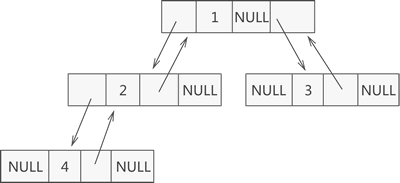

## 二叉树

### 定义

二叉树（英语：Binary tree）是每个结点最多只有`两个分支`（子树）的树结构。通常分支被称作“左子树”或“右子树”。二叉树的分支具有左右次序，不能随意颠倒。

### 性质

- 二叉树中，第 $i$ 层最多有 $2^i-1$ 个结点。
- 如果二叉树的深度为 $K$，那么此二叉树最多有 $2^K-1$ 个结点。
- 二叉树中，终端结点数（叶子结点数）为 $n_0$，度为 2 的结点数为 $n_2$，则 $n_0=n_2+1$。

### 满二叉树

如果二叉树中除了叶子结点，每个结点的度都为 2，则此二叉树称为满二叉树。

### 完全二叉树

如果二叉树中除去最后一层结点为满二叉树，且最后一层的结点依次从左到右分布，则此二叉树被称为完全二叉树。

## 二叉树的顺序存储结构

### 顺序表

`满二叉树`或`完全二叉树`可以使用顺序表表示

_完全二叉树_：

_顺序表_：

可以将非满二叉树转换成`满二叉树`或`完全二叉树`，然后用顺序表表示

_普通二叉树转为满二叉树_：

_顺序表_：

> 注意：顺序表图中上排表示结点的值，并不一定是按顺序递增的，下排表示数组索引

#### 寻找左右子结点

左结点：lc_index = (index + 1)*2 - 1
右结点：rc_index = (index + 1)*2
父结点：f_index = (index + 1)/2 - 1

### 链表

通过链表连接各个结点

_结点结构_：

> 还可以添加一个成员表示父结点，构成双向引用
>
> 

## 二叉查找树

二叉排序树（Binary Sort Tree，简称 BST ）又叫二叉查找树和二叉搜索树，是一种实现动态查找表的树形存储结构。

### 特性

- 对于树中的每个结点，如果它有左子树，那么左子树上`所有结点`的值都比该结点`小`；
- 对于树中的每个结点，如果它有右子树，那么右子树上`所有结点`的值都比该结点`大`。

## 平衡二叉树

平衡二叉(查找)树，又称为 AVL 树

### 特性

- 每棵子树中的左子树和右子树的`深度差`不能超过 `1`；
- 二叉树中`每棵子树`都要求是`平衡二叉树`；

可以通过旋转将非平衡的二叉查找树转化为平衡二叉树：

## 红黑树

特殊的二叉查找树，并不一定是平衡二叉树，它的统计性能要好于平衡二叉树

### 特性

1. 结点是红色或黑色。
2. 根结点是黑色。
3. 所有叶子都是黑色。（叶子是 NIL 结点）
4. 每个红色结点的两个子结点都是黑色。（从每个叶子到根的所有路径上不能有两个连续的红色结点）
5. 从任一结点到其每个叶子的所有路径都包含相同数目的黑色结点。

这些约束确保了红黑树的关键特性：**从根到叶子的最长的可能路径不多于最短的可能路径的两倍长**。结果是这个树大致上是`平衡`的。因为操作比如插入、删除和查找某个值的最坏情况时间都要求与树的高度成比例，这个在高度上的理论上限允许红黑树在最坏情况下都是高效的，而不同于普通的二叉查找树。

要知道为什么这些性质确保了这个结果，注意到`性质4`导致了路径**不能有两个毗连的红色**结点就足够了。最短的可能路径**都是黑色结点**，最长的可能路径有**交替的红色和黑色结点**。因为根据`性质5`所有最长的路径都有相同数目的黑色结点，这就表明了没有路径能多于任何其他路径的两倍长。

- 最短路径：黑-黑-黑，
- 可能路径：黑-红-黑-黑/黑-黑-红-黑，
- 最长路径：黑-红-黑-红-黑（根和叶子必须为黑，红色不能相邻）

在很多树数据结构的表示中，一个结点有可能只有一个子结点，而叶子结点包含数据。用这种范例表示红黑树是可能的，但是这会改变一些性质并使算法复杂。为此，本文中我们使用"nil 叶子"或"空（null）叶子"，如上图所示，它不包含数据而只充当树在此结束的指示。这些结点在绘图中经常`被省略`，导致了这些树好像同上述原则相矛盾，而实际上不是这样。与此有关的结论是**所有结点都有两个子结点**，尽管其中的一个或两个可能是空叶子。

## 多路查找树

区别于二叉查找树，多路查找树的子结点可以超过 2，且必须是满树（子结点数量只能是最大或零）。

### 2-3 树

- 子结点数为 2 或 3。
- 一个 `2 结点`包含`一个元素和两个孩子`（或没有孩子），且与二叉排序树类似，左子树包含的元素小于该元素，右子树包含的元素大于该元素。不过，与二叉排序树不同的是，这个 2 结点要么没有孩子，要有就有两个，不能只有一个孩子。
- 一个 `3 结点`包含一小一大`两个元素和三个孩子`（或没有孩子），一个 3 结点要么没有孩子，要么具有 3 个孩子。如果某个 3 结点有孩子的话，左子树包含小于较小元素的元素，右子树包含大于较大元素的元素，中间子树包含介于两元素之间的元素。
- 2-3 树中所有`叶子`都在`同一层次`上。

## B 树

B 树（B-Tree，B-树）是一种`平衡的多路查找树`，结点最大的孩子数目称为 B 树的阶（order），如 2-3 树就是一种 3 阶 B 树

相比于平衡二叉树或红黑树，B 树进一步减少了树的层数，在查找性能上可能不如平衡二叉树，但对于数据的`访问次数减少`了。我们把读取树中的一个结点视为一次读取操作，层数越少，读取次数就越少。这一点在向硬盘读取时比较重要，通过将一个`结点大小`和硬盘的`页大小`匹配，由于硬盘读取是以`页为单`位的，读页次数会远小于平衡二叉树。

## B+ 树

B 树还是有缺陷的，对于树结构来说，可以通过`中序遍历`(先遍历左子树，然后访问根结点，最后遍历右子树)来顺序查找树中的元素，这一切都是在内存中进行。但是在 B 树中，往返于每个结点就意味着，必须得在硬盘的页面之间进行多次访问，例如，遍历下面这棵 B 树，假设每个结点都属于硬盘的不同页面，`中序遍历`所有元素就需要访问：页面 2→ 页面 1→ 页面 3→ 页面 1→ 页面 4→ 页面 1→ 页面 5。即每次经过结点遍历时，都会对结点中的元素进行一次遍历，如何让遍历时每个元素只访问一次就成了需要解决的问题。

*B 树*：

为了更简单的遍历，而产生了 B+ 树。B+ 树是应`文件系统`所需而出的一种 B 树的变形树，在 B 树中，每一个元素在该树中只出现一次，有可能在叶子结点上，也有可能在分支结点（非叶子结点）上。而在 B+ 树中，出现在分支结点中的元素会被当做它们在该分支结点位置的中序后继者（叶子结点）中再次列出。另外，每一个叶子结点都会保存一个指向后一叶子结点的指针。

*B+ 树*：

也就是`叶子节点`包含了`所有数据`，非叶子节点可以视为只是一种`索引`（不存放 value，只存放 key）。`查找时`做法和 B 树一样从根结点开始，继承了该特性；而由于`后续指针`的存在，`遍历时`只需遍历所有叶子节点即可。这是一种空间换性能的做法。

## 参考

- [平衡二叉树（AVL 树）及 C 语言实现](http://data.biancheng.net/view/59.html)
- [30 张图带你彻底理解红黑树](https://www.jianshu.com/p/e136ec79235c)
