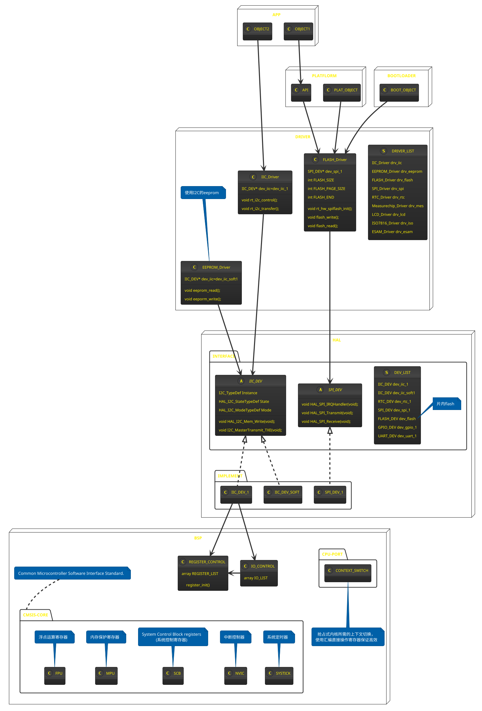

## 整体框架

![plantuml](https://www.plantuml.com/plantuml/png/ZLPRRzn457xVNp7agGLjfUG1K2Yb6w_J67RNndRJWYfPhZsRM5tRg_6aLRH4QajBqa129KeQIg5HnIK89MbKBa5Db3-pzcwU-XSOx-LaV5b4NkATx_lEcNCvCtCne2QX2swZy0QTnov6rnkcTQDumtFcvccXoRxDEOnAYeBEdw_vDhvm0RKAYFrP3JC8a3preIZe4wr2RsqfWum3iWJ6b4f9dwx8QZNVP4cHSip58gDlCyVab2ph5RbK5jLycmnFgn4dBwlIR5OQKB9WqG5eL2IDQT7WJv84eqoScvWWczmq7CS2I1GLLQxoACPDuhj0cAwKj1aUhxCzpWEiAH8F1aq785LFU2NK0gYApM21O6lUQV8K5mT0gGXb7cfODa2I9h_pxlZRYP027s1HAoK32amtNI4k9QaqYRDl8XltalJ-uByn3fIRlcCZGWrdmZ8itwF4Rvmv-rukJ8df1NLC69xn3bd_dni8_3fDRQ9V9eDWqsOUCfXFNECMSIXEklTyYX7rcvEeVNJSURGjJGYT9_VwjhZzyKLl9MeDssELvlBYU7GWqgHFnPnbfNH978M9jN8cW_EtOW-zNZCSpw6P6FiGX9Z583NfyPifLTB3CuIacYwgqoL1JCwKE9ipK6mLGOECGg1oC1A04dggWzocKWi325Xo-YufaWpGNDFnETtbage3jc0Ioh1K8v3us4H-7IASdCpww3nO3h-uVxg6FRkdxlqmhxCScHRbfehPuX8r8HZwOXENSHr9Na1Dpy80ia8OCK6Z9iL3LlmZIwdwDZ3YxsIzWOLTuqgl8-BbT5Vq66P0CT7ZqNGTQkXNHPwwb1VJe3AjhCiOaTIFPqpFRc2IvnDeGu__ILAnXTd4PNUqb6pIgb8Hgs9jq8-9p1lZBL2a8KsUrfCeX0T2SCXVLzg8wvJrdY3NT5Mkd2R79CHSZ96udGQsE8agNcBheZfA27Wi1-mjWkUSk723eo0dAMD2LPEqeY2hubXYazedcYu97xLo3y7EorUTLy_2tIVHux_2xxOvMMrM4l8rxOETQ6CdMlyrN4bfD64gNw8jiisxIEXV66YguLitq32cu9ftfh-FWSszU-7E9hDybZDTLIxdcsQZoTZjun-YrPz0oP_aeuJHdxkTk_zqZnzsTX-3C3UnokMY8gjwCgrn_SIhkg5TaNHX1bma7LttAVNT-80PI_B7cF_Lv-7QLdZuDOiWsZg87jm-UNgRtKNjWzNsmPVHndAuiXojFNzz-DKrhtzNHVlBdSEDplT_HEi_Hz-ijO-UmhvP_DszEoU_RqRVhYJYPBuJhJ79Yk2wleUgZaNymGtEXXTfVftUCWb6aaSngPiMZayYppQ9VIv-VC5yeMBn0jVvXTDFL6pWEcLekicJuf4mEl_PkNC8kAoskpzsrbzaO1XcOCGp30mOQ82vvn_pFpJ1uFilktSU5U0nCf8nk8A0CFG11Ex5siDvmIIAqMXpBtpuIxYwrJqwElbjFrpTVdtuh51If0mVZ7AFwD6aFjvFBBEMMf-0S8Qoxj_RuVxTxelFMKDzKBY8FNl1RVmB)

