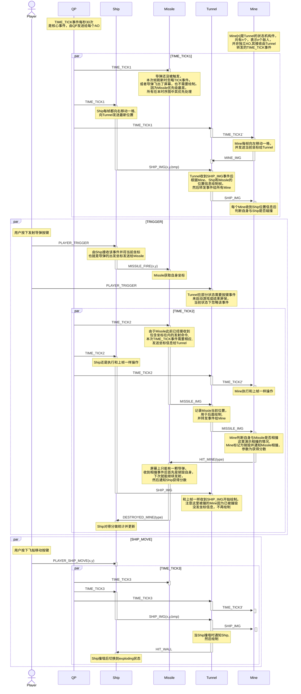

## 前言

阅读本文需要 QP 框架基础，建议先阅读[《UML 状态图的实用 C/C++设计》(QP 状态机)学习笔记](/posts/quantum-platform-1/)

## 介绍

QP/C 框架在其源码中提供了一个“飞行和射击”游戏示例，可以运行在 Windows 和 ARM 裸机双平台

## 构建

### 资源文件

该示例为 Windows 编写了一套模拟 bsp -- qwin_gui，利用了 Windows SDK 中的绘图功能实现了虚拟的 LCD、按键、LED 功能。

官方仅提供了 Visual studio 工程，不过我们可以使用 GCC 和 windres 来对项目进行构建:

1. 首先，对资源文件`Resource.rc`进行编译，转为 GCC 可以识别的中间 object 文件：

   ```bash
   windres .\Resource.rc -o Resource.o
   ```

2. 在最终编译 exe 时将其加入参数，即可构建得到包含该资源文件的可执行文件。

## 源码解析

main.c:

```c
// windows下资源较丰富，增加10倍的事件队列容量
enum { WIN_FUDGE_FACTOR = 10 };

int main() {
    // 为每个AO分配事件队列空间
    static QEvt const *missileQueueSto[2*WIN_FUDGE_FACTOR];
    static QEvt const *shipQueueSto[3*WIN_FUDGE_FACTOR];
    static QEvt const *tunnelQueueSto[(GAME_MINES_MAX + 5)*WIN_FUDGE_FACTOR];
    // 为动态事件分配池空间
    static QF_MPOOL_EL(QEvt) smlPoolSto[10*WIN_FUDGE_FACTOR];
    static QF_MPOOL_EL(ObjectImageEvt)
           medPoolSto[(2*GAME_MINES_MAX + 10)*WIN_FUDGE_FACTOR];
    // 共有MAX_PUB_SIG个可供订阅的事件，创建相同数量的订阅位图，
    // 位图中的每一位对应一个AO(优先级)，置位表示该AO订阅该事件
    static QSubscrList subscrSto[MAX_PUB_SIG];

    QF_init();  /* initialize the framework and the underlying RT kernel */
    BSP_init(); /* initialize the Board Support Package */

    /* init publish-subscribe... */
    QF_psInit(subscrSto, Q_DIM(subscrSto));

    /* initialize the event pools... */
    QF_poolInit(smlPoolSto, sizeof(smlPoolSto), sizeof(smlPoolSto[0]));
    QF_poolInit(medPoolSto, sizeof(medPoolSto), sizeof(medPoolSto[0]));

    /* object dictionaries for AOs... */
    QS_OBJ_DICTIONARY(AO_Missile);
    QS_OBJ_DICTIONARY(AO_Ship);
    QS_OBJ_DICTIONARY(AO_Tunnel);

    /* signal dictionaries for globally published events... */
    QS_SIG_DICTIONARY(TIME_TICK_SIG,      (void *)0);
    QS_SIG_DICTIONARY(PLAYER_TRIGGER_SIG, (void *)0);
    QS_SIG_DICTIONARY(PLAYER_QUIT_SIG,    (void *)0);
    QS_SIG_DICTIONARY(GAME_OVER_SIG,      (void *)0);

    /* start the active objects... */
    // 调用对象的构造函数
    Tunnel_ctor_call();
    // 渲染对象，优先级最低
    QACTIVE_START(AO_Tunnel,
                  1U,                /* QP priority */
                  tunnelQueueSto,  Q_DIM(tunnelQueueSto), /* evt queue */
                  (void *)0, 0U,     /* no per-thread stack */
                  (QEvt *)0);        /* no initialization event */
    Ship_ctor_call();
    // 战舰对象
    QACTIVE_START(AO_Ship,
                  2U,                /* QP priority */
                  shipQueueSto,    Q_DIM(shipQueueSto), /* evt queue */
                  (void *)0, 0U,     /* no per-thread stack */
                  (QEvt *)0);        /* no initialization event */
    Missile_ctor_call();
    // 导弹对象，优先级最高
    QACTIVE_START(AO_Missile,
                  3U,                /* QP priority */
                  missileQueueSto, Q_DIM(missileQueueSto), /* evt queue */
                  (void *)0, 0U,     /* no per-thread stack */
                  (QEvt *)0);        /* no initialization event */

    return QF_run(); /* run the QF application */
}
```

### 时序图



### Missile 主动对象


该 AO 有三个状态：

- **armed**：装填就绪，初始状态，收到 MISSILE_FIRE 事件后发射导弹进入 flying。
- **flying**：飞行中，接收 TIME_TICK 事件，判断当下一帧的坐标没有超出屏幕时，将下一帧的位置和显示图片发送给 Tunnel；否则回到 armed 状态。当收到 HIT_MINE 事件时通知 Ship 该分数，同时回到 armed 状态。收到 HIT_WALL 表示撞墙了，进入 exploding 播放爆炸动画。
- **exploding**：爆炸，一个持续 16 帧的动画，从 exp_ctr 计数 0 开始到 16，每帧的横坐标要减去 GAME_SPEED_X 保持和卷轴滚动同步，来模拟导弹撞墙爆炸后的静止状态。每帧显示的爆炸图片也会根据 exp_ctr 产生变化，模拟爆炸动画效果。结束后回到 armed 状态。

### Ship 主动对象


控制着战舰的逻辑，有 4 个状态：

- **active**：超状态，处理 PLAYER_SHIP_MOVE 事件，战舰的位置并不是本 AO 控制的，而是外部传入的。在所有子状态中都要处理该事件以保存实时位置。比如 parked 时如果不处理该事件，等到起飞时就不知道初始位置了。
- **parked**：停机状态，初始状态，游戏开始收到 TAKE_OFF 后进入 flying 状态
- **flying**：飞行中，进入时初始化得分，每个 TIME_TICK 发送当前位置给 Tunnel 并增加得分。当发射导弹的按键按下时给 Missile 发送 MISSLE_FIRE 事件，无论其当前处于什么状态。收到 DESTROYED_MINE 事件时更新得分。因为飞机不会飞出边界，所以仅处理 HIT_WALL 和 HIT_MINE 事件，进入 exploding 状态。
- **exploding**：和[Missile 主动对象](#missile-主动对象)的 exploding 相同。最后发出 GAME_OVER 事件

#### Ship 的实现

```c
#define SHIP_WIDTH  5
#define SHIP_HEIGHT 3

/* encapsulated delcaration of the Ship active object ----------------------*/
/*$declare${AOs::Ship} vvvvvvvvvvvvvvvvvvvvvvvvvvvvvvvvvvvvvvvvvvvvvvvvvvvvv*/

/*${AOs::Ship} .............................................................*/
// 继承自QActive，并添加了4个私有成员变量
typedef struct Ship {
/* protected: */
    QActive super;

/* private: */
    uint8_t x;
    uint16_t y;
    uint8_t exp_ctr;
    uint16_t score;

/* public: */
} Ship;

/* public: */
static void Ship_ctor(Ship * const me);
extern Ship Ship_inst;

/* protected: */
// 5个状态
static QState Ship_initial(Ship * const me, void const * const par);
static QState Ship_active(Ship * const me, QEvt const * const e);
static QState Ship_parked(Ship * const me, QEvt const * const e);
static QState Ship_flying(Ship * const me, QEvt const * const e);
static QState Ship_exploding(Ship * const me, QEvt const * const e);
/*$enddecl${AOs::Ship} ^^^^^^^^^^^^^^^^^^^^^^^^^^^^^^^^^^^^^^^^^^^^^^^^^^^^^*/

/* Public-scope objects ----------------------------------------------------*/
/*$skip${QP_VERSION} vvvvvvvvvvvvvvvvvvvvvvvvvvvvvvvvvvvvvvvvvvvvvvvvvvvvvvv*/
/* Check for the minimum required QP version */
#if (QP_VERSION < 700U) || (QP_VERSION != ((QP_RELEASE^4294967295U) % 0x3E8U))
#error qpc version 7.0.0 or higher required
#endif
/*$endskip${QP_VERSION} ^^^^^^^^^^^^^^^^^^^^^^^^^^^^^^^^^^^^^^^^^^^^^^^^^^^^*/

/*$define${Shared::AO_Ship} vvvvvvvvvvvvvvvvvvvvvvvvvvvvvvvvvvvvvvvvvvvvvvvv*/

/*${Shared::AO_Ship} .......................................................*/
QActive * const AO_Ship = &Ship_inst.super;
/*$enddef${Shared::AO_Ship} ^^^^^^^^^^^^^^^^^^^^^^^^^^^^^^^^^^^^^^^^^^^^^^^^*/

/* Active object definition ------------------------------------------------*/
/*$define${Shared::Ship_ctor_call} vvvvvvvvvvvvvvvvvvvvvvvvvvvvvvvvvvvvvvvvv*/

/*${Shared::Ship_ctor_call} ................................................*/
void Ship_ctor_call(void) {
    Ship_ctor(&Ship_inst);
}
/*$enddef${Shared::Ship_ctor_call} ^^^^^^^^^^^^^^^^^^^^^^^^^^^^^^^^^^^^^^^^^*/
/*$define${AOs::Ship} vvvvvvvvvvvvvvvvvvvvvvvvvvvvvvvvvvvvvvvvvvvvvvvvvvvvvv*/

/*${AOs::Ship} .............................................................*/
Ship Ship_inst;

/*${AOs::Ship::ctor} .......................................................*/
// 构造函数
static void Ship_ctor(Ship * const me) {
    // 调用父类构造函数
    QActive_ctor(&me->super, Q_STATE_CAST(&Ship_initial));
    // 初始化私有成员
    me->x = GAME_SHIP_X;
    me->y = (GAME_SHIP_Y << 2);
}

/*${AOs::Ship::SM} .........................................................*/
// 初始伪状态
static QState Ship_initial(Ship * const me, void const * const par) {
    /*${AOs::Ship::SM::initial} */
    (void)par; /* usused parameter */

    QActive_subscribe(&me->super, TIME_TICK_SIG);
    QActive_subscribe(&me->super, PLAYER_TRIGGER_SIG);

    /* local signals... */
    //QS_SIG_DICTIONARY(PLAYER_SHIP_MOVE_SIG, me);
    QS_SIG_DICTIONARY(TAKE_OFF_SIG,         me);
    QS_SIG_DICTIONARY(HIT_WALL_SIG,         me);
    QS_SIG_DICTIONARY(HIT_MINE_SIG,         me);
    QS_SIG_DICTIONARY(DESTROYED_MINE_SIG,   me);

    QS_FUN_DICTIONARY(&Ship_active);
    QS_FUN_DICTIONARY(&Ship_parked);
    QS_FUN_DICTIONARY(&Ship_flying);
    QS_FUN_DICTIONARY(&Ship_exploding);

    return Q_TRAN(&Ship_active);
}

/*${AOs::Ship::SM::active} .................................................*/
static QState Ship_active(Ship * const me, QEvt const * const e) {
    QState status_;
    switch (e->sig) {
        /*${AOs::Ship::SM::active::initial} */
        case Q_INIT_SIG: {
            status_ = Q_TRAN(&Ship_parked);
            break;
        }
        default: {
            status_ = Q_SUPER(&QHsm_top);
            break;
        }
    }
    return status_;
}

/*${AOs::Ship::SM::active::parked} .........................................*/
static QState Ship_parked(Ship * const me, QEvt const * const e) {
    QState status_;
    switch (e->sig) {
        /*${AOs::Ship::SM::active::parked::TAKE_OFF} */
        case TAKE_OFF_SIG: {
            status_ = Q_TRAN(&Ship_flying);
            break;
        }
        default: {
            status_ = Q_SUPER(&Ship_active);
            break;
        }
    }
    return status_;
}

/*${AOs::Ship::SM::active::flying} .........................................*/
static QState Ship_flying(Ship * const me, QEvt const * const e) {
    QState status_;
    switch (e->sig) {
        /*${AOs::Ship::SM::active::flying} */
        case Q_ENTRY_SIG: {
            ScoreEvt *sev;
            me->score = 0U; /* reset the score */
            sev = Q_NEW(ScoreEvt, SCORE_SIG);
            sev->score = me->score;
            QACTIVE_POST(AO_Tunnel, (QEvt *)sev, me);

            /* lauch the ship from the initial position */
            me->x = GAME_SHIP_X;
            me->y = (GAME_SHIP_Y << 2);
            status_ = Q_HANDLED();
            break;
        }
        /*${AOs::Ship::SM::active::flying::TIME_TICK} */
        case TIME_TICK_SIG: {
            ObjectImageEvt *oie;

            if (BSP_isThrottle()) {
                if (me->y > 0) {
                    me->y -= 1U;
                }
            }
            else {
                if (me->y < (GAME_TUNNEL_HEIGHT << 2)) {
                    me->y += 1U;
                }
            }

            /* tell the Tunnel to draw the Ship and test for hits */
            oie = Q_NEW(ObjectImageEvt, SHIP_IMG_SIG);
            oie->x   = me->x;
            oie->y   = (uint8_t)(me->y >> 2);
            oie->bmp = SHIP_BMP;
            QACTIVE_POST(AO_Tunnel, (QEvt *)oie, me);

            ++me->score; /* increment the score for surviving another tick */

            if ((me->score % 10U) == 0U) { /* is the score "round"? */
                ScoreEvt *sev = Q_NEW(ScoreEvt, SCORE_SIG);
                sev->score = me->score;
                QACTIVE_POST(AO_Tunnel, (QEvt *)sev, me);
            }
            status_ = Q_HANDLED();
            break;
        }
        /*${AOs::Ship::SM::active::flying::PLAYER_TRIGGER} */
        case PLAYER_TRIGGER_SIG: {
            ObjectPosEvt *ope = Q_NEW(ObjectPosEvt, MISSILE_FIRE_SIG);
            ope->x = me->x;
            ope->y = (me->y >> 2) + SHIP_HEIGHT - 1U;
            QACTIVE_POST(AO_Missile, (QEvt *)ope, me);
            status_ = Q_HANDLED();
            break;
        }
        /*${AOs::Ship::SM::active::flying::DESTROYED_MINE} */
        case DESTROYED_MINE_SIG: {
            me->score += Q_EVT_CAST(ScoreEvt)->score;
            /* the score will be sent to the Tunnel by the next TIME_TICK */
            status_ = Q_HANDLED();
            break;
        }
        /*${AOs::Ship::SM::active::flying::HIT_WALL} */
        case HIT_WALL_SIG: {
            status_ = Q_TRAN(&Ship_exploding);
            break;
        }
        /*${AOs::Ship::SM::active::flying::HIT_MINE} */
        case HIT_MINE_SIG: {
            status_ = Q_TRAN(&Ship_exploding);
            break;
        }
        default: {
            status_ = Q_SUPER(&Ship_active);
            break;
        }
    }
    return status_;
}

/*${AOs::Ship::SM::active::exploding} ......................................*/
static QState Ship_exploding(Ship * const me, QEvt const * const e) {
    QState status_;
    switch (e->sig) {
        /*${AOs::Ship::SM::active::exploding} */
        case Q_ENTRY_SIG: {
            me->exp_ctr = 0U;
            status_ = Q_HANDLED();
            break;
        }
        /*${AOs::Ship::SM::active::exploding::TIME_TICK} */
        case TIME_TICK_SIG: {
            /*${AOs::Ship::SM::active::exploding::TIME_TICK::[me->exp_ctr<15U]} */
            if (me->exp_ctr < 15U) {
                ObjectImageEvt *oie;
                ++me->exp_ctr;
                /* tell the Tunnel to draw the current stage of Explosion */
                oie = Q_NEW(ObjectImageEvt, EXPLOSION_SIG);
                oie->bmp = EXPLOSION0_BMP + (me->exp_ctr >> 2);
                oie->x   = me->x; /* x of explosion */
                oie->y   = (int8_t)((int)(me->y >> 2) - 4U + SHIP_HEIGHT);
                QACTIVE_POST(AO_Tunnel, (QEvt *)oie, me);
                status_ = Q_HANDLED();
            }
            /*${AOs::Ship::SM::active::exploding::TIME_TICK::[else]} */
            else {
                ScoreEvt *gameOver = Q_NEW(ScoreEvt, GAME_OVER_SIG);
                gameOver->score = me->score;
                QACTIVE_POST(AO_Tunnel, (QEvt *)gameOver, me);
                status_ = Q_TRAN(&Ship_parked);
            }
            break;
        }
        default: {
            status_ = Q_SUPER(&Ship_active);
            break;
        }
    }
    return status_;
}
```

### Tunnel 主动对象


用于显示和逻辑处理的 AO，同时其管理这数个 Mine 对象:

- `active`：超状态，处理 MINE_DISABLE 事件，用于管理 Mine 对象。同时在 PLAYER_QUIT 事件时结束 AO。
- `demo`：开始界面状态，负责绘制初始界面，进入时注册一个 20 秒的定时器，定时 20 秒后触发 SCREEN_TIMEOUT 事件切换到 screen_saver 屏保状态。按下开始游戏按键时触发 PLAYER_TRIGGER 事件切换到 playing 状态。注意退出时要清空该定时器，应该该定时器仅由 demo 状态使用。
- `playing`：游戏中状态，负责处理游戏逻辑。收到 Ship 发送的 GAME_OVER 事件后切换到 game_over 状态。
- `game_over`：游戏结束状态，显示分数，超时后返回 demo 状态。
- `screen_saver`：屏保状态

### Mine 构件

Mine 也是一个层次状态机，但不是主动对象，而是 Tunnel 的构件，共享其事件队列和优先级。

Tunnel 通过 `QHsm_dispatch()` 给 Mine 构件派送事件，而不是通过 `QActive_postFIFO()`在 AO 间传递事件。

Tunnel 中的 **mines 数组**管理着这些 Mine 构件，每个元素是一个指向 Mine 对象(继承自 QHsm)的指针，所以对象的销毁也需要 Tunnel 管理：


每个 Mine 对象都是自治的，维护自己的位置，判断碰撞和移出屏幕等。


Mine 状态机构成：

- `unused`：未启用状态，初始状态。收到 MINE_PLANT 事件时切换到 planted 状态，并根据坐标信息参数更新自身起始坐标。
- `used`：启用状态，一个超状态，用于在退出时发送销毁事件 MINE_DISABLED 给 Tunnel。
- `planted`：绘制状态，也就是正常运行时的状态。每个 TIME_TICK 判断下帧的位置是否在屏幕外，如果否，则发送下帧位置给 Tunnel，如果是，则返回 unused 状态。收到 SHIP_IMG 时判断是否碰撞，发送碰撞事件给 Ship。收到 MISSILE_IMG 时判断碰撞并销毁自身，并发送事件通知 Missile。
- `exploding`：爆炸状态，处理 Mine 被导弹击中的爆炸动画（与 Ship 相撞的动画不在这里处理），和[Missile 主动对象](#missile-主动对象)的 exploding 类似

### 事件

用到的几类事件定义，都继承自 QEvt：

```c
// 坐标事件，如导弹的出发位置
typedef struct {
/* protected: */
    QEvt super;

/* public: */
    uint8_t x;
    uint8_t y;
} ObjectPosEvt;

// 坐标和图像事件
typedef struct {
/* protected: */
    QEvt super;

/* public: */
    uint8_t x;
    int8_t y;
    uint8_t bmp;
} ObjectImageEvt;

// Mine管理相关事件
typedef struct {
/* protected: */
    QEvt super;

/* public: */
    uint8_t id;
} MineEvt;

// 得分事件
typedef struct {
/* protected: */
    QEvt super;

/* public: */
    uint16_t score;
} ScoreEvt;
```

#### TICK 事件

下面介绍的是在开发板上通过中断产生的 TICK 事件，而不是 Windows 版本模拟的 TICK 事件。

TIME_TICK 事件在 ISR 中产生：

```c
/* ISRs used in the application ==========================================*/
void SysTick_Handler(void) {
    // 静态的const类型，放在ROM区，用于“零复制”的静态事件
    static QEvt const tickEvt = { TIME_TICK_SIG, 0U, 0U };

#ifdef Q_SPY
    {
        /* clear SysTick_CTRL_COUNTFLAG */
        uint32_t volatile tmp = SysTick->CTRL;
        (void)tmp; /* avoid compiler warning about unused local variable */
        QS_tickTime_ += QS_tickPeriod_;   /* account for the clock rollover */
    }
#endif

    //QTIMEEVT_TICK_X(0U, &l_SysTick_Handler); /* process time events for rate 0 */
    /**
     * the_Ticker0 是 QTicker 类的对象。
     * QTicker 是一个高效的活动对象，专门用于以指定的
     * tick 速率 [0...#QF_MAX_TICK_RATE] 处理 QF 系统时钟 tick。
     * 将系统时钟滴答处理置于活动对象中，可以将非确定性 QTIMEEVT_TICK_X()
     * 处理从中断级移除，并将其移入线程级，在线程级中可以根据需要降低优先级。
     *
     * QTIMEEVT_TICK_X()宏用于管理用户生成的周期性或非周期性定时器事件，
     * 每次执行时会扫描链表中是否有到期的定时器，并发送相应定时器事件。
     * 将该操作放在线程级而非中断中能提高中断处理的性能。很像Linux内核
     * 中的中断下半部中的工作队列。
     */
    // 向the_Ticker0推送空事件,QTicker只有一个状态，且不管什么事件都会执行相同操作
    QACTIVE_POST(the_Ticker0, 0, 0); /* post a don't-care event to Ticker0 */
    // 发布一个TICK事件，所有订阅者都能收到
    QACTIVE_PUBLISH(&tickEvt, &l_SysTick_Handler); /* publish to all subscribers */

    // 按钮扫描
    {
        /* state of the button debouncing, see below */
        static struct ButtonsDebouncing {
            uint32_t depressed;
            uint32_t previous;
        } buttons = { 0U, 0U };
        uint32_t current;
        uint32_t tmp;

       /* Perform the debouncing of buttons. The algorithm for debouncing
       * adapted from the book "Embedded Systems Dictionary" by Jack Ganssle
       * and Michael Barr, page 71.
       */
       current = ~GPIO->P[PB_PORT].DIN; /* read PB0 and BP1 */
       tmp = buttons.depressed; /* save the debounced depressed buttons */
       buttons.depressed |= (buttons.previous & current); /* set depressed */
       buttons.depressed &= (buttons.previous | current); /* clear released */
       buttons.previous   = current; /* update the history */
       tmp ^= buttons.depressed;     /* changed debounced depressed */
       if ((tmp & (1U << PB0_PIN)) != 0U) {  /* debounced PB0 state changed? */
           if ((buttons.depressed & (1U << PB0_PIN)) != 0U) {/*PB0 depressed?*/
               static QEvt const trigEvt = { PLAYER_TRIGGER_SIG, 0U, 0U};
               QACTIVE_PUBLISH(&trigEvt, &l_SysTick_Handler);
           }
       }
    }
    QV_ARM_ERRATUM_838869();
}
```
