## 简介

传统上，绝大多数软件应用程序都是作为**顺序程序**编写的，也就是**冯·诺伊曼**架构。这些程序的执行可以被人理解为根据程序计数器的概念，按顺序逐步浏览代码。程序计数器包含处理器将要执行的下一条指令的内存地址。

与之相对的就是**并行程序**，其中多个执行线程合作以更快地完成工作。

### 异构并行计算

CPU 的设计优化是为了顺序代码性能：

- 算术单元(ALU)和操作数传递逻辑的设计旨在最小化算术操作的有效延迟，代价是增加单位的芯片面积和功耗。
- 大型的末级片上 cache 被设计用来捕获经常访问的数据，并将一些长延迟的内存访问转换为短延迟的缓存访问。
- 先进的分支预测逻辑和执行控制逻辑用于减轻条件分支指令的延迟。

也就是说 CPU 专注于减少**单个线程**的执行延迟。然而，低延迟的算术单元、复杂的操作数传递逻辑、大缓存内存和控制逻辑消耗了本可以用于提供更多算术执行单元和内存访问通道的芯片面积和功耗。这种设计方法通常被称为**面向延迟**设计。


而 GPU 则是面向吞吐量设计的。GPU 的设计哲学是由快速增长的视频游戏行业塑造的，游戏的每个视频帧中会执行大量浮点运算和内存访问，而不是执行大量的控制逻辑和复杂的操作数。

## 异构数据并行计算

### 数据并行性

如果有大量数据要处理，同时每个数据的处理又很简单且独立，则称为拥有数据并行性

比如将 RGB 图像转为灰度图像


要将每个像素做如下处理：

$$L=0.21r+0.72g+0.07b$$


每个像素的处理很简单，且可以独立计算

### CUDA C 程序结构

CUDA C 通过最小的新语法和库函数将流行的 ANSI C 编程语言进行了扩展，使程序员能够针对包含 CPU 核心和大规模并行 GPU 的异构计算系统进行开发。

CUDA C 程序的结构反映了计算机中主机（CPU）和一个或多个设备（GPU）的共存。每个 CUDA C 源文件可以包含主机代码和设备代码的混合。


如图所示，一共有 4 步：

1. 首先通过 CPU 处理部分逻辑，
2. 然后调用核函数，在设备(GPU)上启动大量**线程(thread)**以执行它们，由内核调用启动的所有线程被集体称为一个**网格(grid)**。当一个网格的所有线程都完成执行时，
3. 该网格终止，并且执行继续在 CPU 上
4. 继续调用核函数，同 2

重复这个过程即可完成上面提到的 RGB 转灰度图像的用例。

其中，**线程**是顺序执行的，和我们之前接触的操作系统里的线程概念相同。

### 矢量加法核函数

传统的 CPU 方式：

```c
void VecAdd(float* A, float* B, float* C, int n)
{
    for (int i = 0;i < N;i++)
    {
      C[i] = A[i] + B[i];
    }
}

int main()
{
    ...
    VecAdd(A, B, C, N);
    ...
}
```

GPU 的实现：


### 设备全局内存和数据传输

设备通常是配有自己的 DRAM，称为**全局内存**，例如，NVIDIA Volta V100 配备了 16GB 或 32GB 的全局内存。

对于矢量加法核函数，在调用核函数之前，程序员需要在全局内存中分配空间并将数据从主机内存传输到全局内存中的已分配空间:


```c
#include <cuda_runtime.h>
int main() {
    // Declare device pointers
    float *A_d, *B_d, *C_d;

    // Allocate space in the device global memory for A
    cudaMalloc((void**)&A_d, size);

    // Your computation with A_d goes here

    // Free the allocated memory for A
    cudaFree(A_d);

    return 0;
}
```

一旦主机代码为数据对象在设备全局内存中分配了空间，它可以请求将数据从主机传输到设备:


完整的内存分配和释放实现：


### 核函数和线程

在 CUDA C 中，核函数指定在并行阶段由所有**线程**执行的代码，所有这些线程执行相同的代码，区别是数据的不同(也就是核函数的实参)。

当程序的主机代码调用核函数时，CUDA 运行时系统会启动一个线程网格，每个网格都组织成一个线程块数组，我们将其简称为块(block)，每个块包含相同数量的线程(当前最大为 1024 个)。


CUDA 核函数可以访问内建变量

- blockIdx：grid 中的 block 序号
- threadIdx：block 中 thread 的序号
- blockDim 变量：是一个结构，标识 block 的每个维度的长度，包含三个无符号整数字段（x、y 和 z），这些字段帮助程序员将线程组织成一维、二维或三维数组。对于一维组织，仅使用 x 字段(即数组的长度)。对于二维组织，使用 x 和 y 字段。对于三维结构，使用所有三个 x、y 和 z 字段。

这些变量允许线程彼此区分，并确定每个线程要处理的数据区域。从上述变量可以计算出一个唯一的全局索引 i，即`i=blockIdx.x * blockDim.x + threadIdx.x`

向量加法核函数代码:


CUDA C 函数声明的关键字(C 语言扩展，类似 GNU 关键字):


- `__global__`表示这样的核函数在设备上执行，并且可以从主机调用。在支持动态并行性的 CUDA 系统中，它也可以从设备调用。重要的特点是调用这样一个核函数会在设备上启动一个新的线程网格。
- `__device__`关键字表示被声明的函数是 CUDA 设备函数。设备函数在 CUDA 设备上执行，只能从**核函数或另一个设备函数**调用。设备函数由调用它的设备线程执行，不会导致启动任何新的设备线程
- `__host__`关键字表示被声明的函数是 CUDA 主机函数。主机函数只是在主机上执行的传统 C 函数，只能从另一个主机函数调用。默认情况下，如果在其声明中没有任何 CUDA 关键字，则 CUDA 程序中的所有函数都是主机函数。

可以在函数声明中同时使用`__host__`和`__device__`。这种组合告诉编译系统为同一函数生成两个版本的目标代码。其中一个在主机上执行，只能从主机函数调用。另一个在设备上执行，只能从设备或核函数调用。

在 CUDA 核函数中，自动变量(上面核函数内的 i 变量)对于每个线程都是私有的。

> 内建变量“threadIdx”、“blockIdx”应该也是，“blockDim”的话每个线程都相同，应该是每个线程都共享的 const 变量。

### 调用核函数


使用的线程块数量取决于向量的长度（n）。假设每个块固定运行 256 个线程。如果 n 为 750，则将使用三个线程块。如果 n 为 4000，则将使用 16 个线程块。如果 n 为 2000000，则将使用 7813 个块。请注意，所有线程块都在向量的不同部分上操作。它们可以以任意顺序执行。程序员不能对执行顺序做出任何假设。

### 编译

实现 CUDA C 核心需要使用多种不属于 C 语言的扩展。一旦这些扩展在代码中被使用，传统的 C 编译器就无法接受它了(类似 GNU 扩展)。代码需要由一个能够识别和理解这些扩展的编译器编译，比如 NVCC（NVIDIA C 编译器）。

NVCC 编译器处理 CUDA C 程序，使用 CUDA 关键字来区分主机代码和设备代码。主机代码是纯粹的 ANSI C 代码，使用主机的标准 C/C++编译器编译，并作为传统的 CPU 进程运行。带有 CUDA 关键字的设备代码指定了 CUDA 核函数及其相关的辅助函数和数据结构，由 NVCC 编译成称为 PTX 文件的虚拟二进制文件。这些 PTX 文件由 NVCC 的运行时组件进一步编译成真实的目标文件，并在支持 CUDA 的 GPU 设备上执行。


## 多维的网格和数据

上面一章介绍了一维的网格和数据，而 CUDA 最高能支持三维。

### 多维网格组织

在 CUDA 中，网格中的所有线程都执行相同的内核函数，并且它们依赖于坐标，即线程索引，以相互区分并识别要处理的数据的适当部分。

一个网格由一个或多个块组成，每个块由一个或多个线程组成。块中的所有线程共享相同的块索引，可以通过 blockIdx（内置）变量访问。每个线程还有一个线程索引，可以通过 threadIdx（内置）变量访问。

一个网格是一个三维（3D）的块数组，每个块是一个三维（3D）的线程数组。在调用内核时，程序需要指定每个维度中网格和块的大小。这是通过内核调用语句的执行配置参数（在 <<<…>>>中）指定的。第一个执行配置参数指定了网格在块数上的维度。第二个指定了每个块在线程数上的维度。（将其中两个维度设置为 1 就是 1 维的结构）


在当前的 CUDA 系统中，块的总大小限制为 1024 个线程。这些线程可以以任何方式分布在三个维度上，只要总线程数不超过 1024。例如，(512, 1, 1)、(8, 16, 4) 和 (32, 16, 2) 这样的 blockDim 值都是允许的，但 (32, 32, 2) 不允许，因为总线程数将超过 1024。

下面是二维的 grid 和三维的 block 的情况：

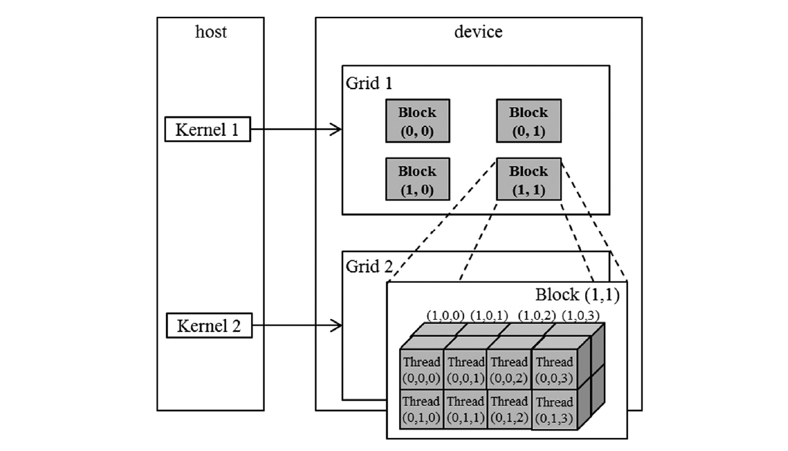

相应的代码：


总线程数是块数 x 每块线程数，又因为每个块中线程数量是相同的，所以，想要总线程数和实际的数据数正好匹配有点难度，比如，数据数是 13，块数为(2,1,1)，将每块线程设为(2,4,1)，那就是 16;每块线程设为(3,3,1)，就是 18，反正正好凑到 13 不太现实。所以会一般都会有一块的线程是不满的，需要手动屏蔽这些线程(加个 if 判断就行)：


### 将线程映射到多维数据

虽然表面是三维，但学过 C 语言的应该都知道，即使是三维数据，其在内存上排列都是一维的，所以理论上这些 block 的多维的结构都可以拉平为一维的。比如 (2,4,1) 完全可以表示为 (8,1,1)。比如用(1280,720,1) 表示的图片，就可以使用标准的 C 数组的 **行主排列** 方式拉平：

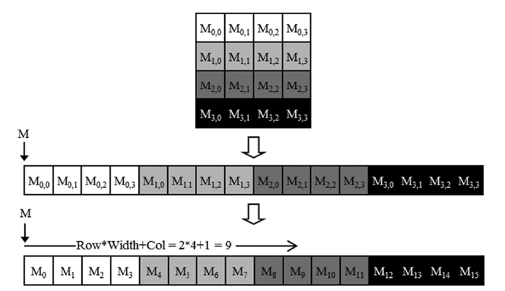

所以多维的表示只是为了符合数据的性质，让编程更加直观，比如，可以写 `if(threadIdx.y<720)` 这种判断语句，最终的结果其实并没有本质区别。

### 图像模糊：一个更复杂的核

在真实的 CUDA C 程序中，线程经常对其数据执行**复杂**的操作，并需要**相互协作**。

下面介绍一个图像模糊的例子：


我们将采用一种简化的方法，通过对围绕目标像素的 N x N 像素块进行简单平均值来进行模糊操作：

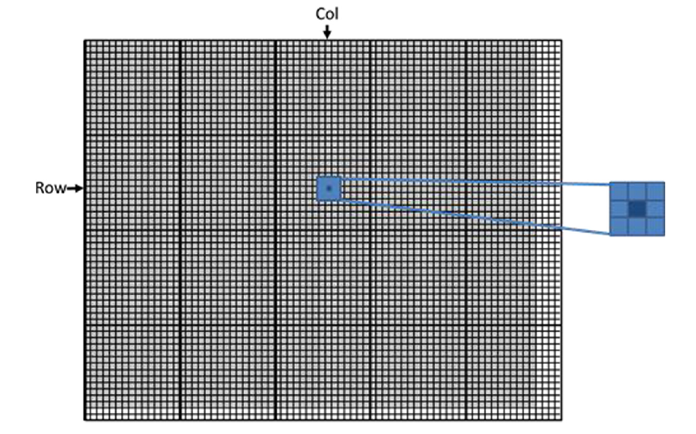

每个核函数处理一个像素点，假设 BLUR_SIZE 为 1，需要读取其周围 8 个像素点和自身的值，求平均：

```c
__global__
void blurKernel(unsigned char *in, unsigned char *out, int w, int h) {
  int col = blockIdx.x * blockDim.x + threadIdx.x;
  int row = blockIdx.y * blockDim.y + threadIdx.y;
  if (col < w && row < h) {
    int pixVal = 0;
    int pixels = 0;
    // Get average of the surrounding BLUR_SIZE x BLUR_SIZE box
    for (int blurRow = -BLUR_SIZE; blurRow < BLUR_SIZE + 1; ++blurRow) { // [-1,0,1]
      for (int blurCol = -BLUR_SIZE; blurCol < BLUR_SIZE + 1; ++blurCol) { // [-1,0,1]
        int curRow = row + blurRow;
        int curCol = col + blurCol;
        // Verify we have a valid image pixel
        if (curRow >= 0 && curRow < h && curCol >= 0 && curCol < w) {
          pixVal += in[curRow * w + curCol]; // or in[curRow][curCol]?
          ++pixels; // Keep track of number of pixels in the avg
        }
      }
    }
    // Write our new pixel value out
    out[row * w + col] = (unsigned char)(pixVal / pixels);
  }
}
```

遇到边界情况时，不读取超出范围的像素，不然会产生数组的越界访问：

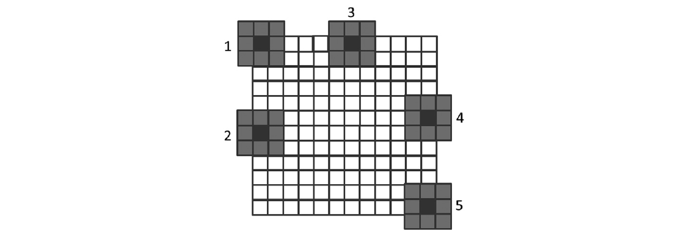

## 计算架构和调度

### 现代 GPU 架构

由一系列高度线程化的流多处理器（Streaming Multiprocessor, SM）组成。每个 SM 有多个处理单元，称为流处理器或 CUDA 核心（以下简称为核心），如图中 SM 内显示的**绿色小块**所示，它们共享**控制逻辑**和**内存资源**。例如，Ampere A100 GPU 具有 108 个 SM，每个 SM 有 64 个核心，总共在整个 GPU 中有 6912 个核心。

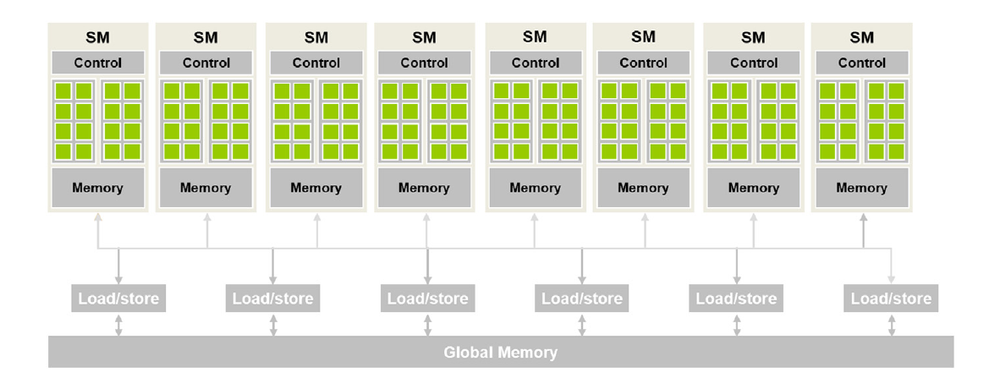

### 块调度

当调用内核时，CUDA 运行时系统启动一个执行内核代码的线程网格(grid)。这些线程根据块(block)逐块分配给 SM。也就是说，同一块中的所有线程(thread)同时分配给同一个 SM:

- block -- SM
- thread -- CUDA 核心

不过 SM 并不仅仅只能处理一个块，可以同时为其分配有限个块：

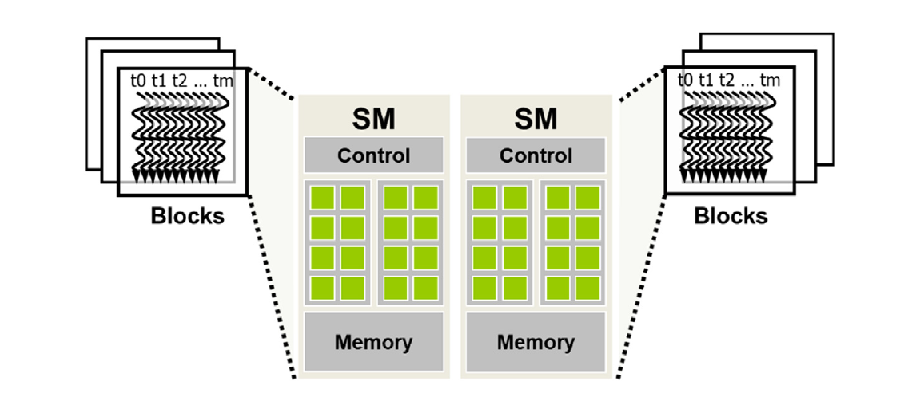

所以同时可以处理的块数量是有限的，没有分配到 SM 的块会在队列里等待。

线程按块逐块分配给 SM 的方式确保了同一块中的线程同时在同一个 SM 上调度。这一保证使得**同一块**中的线程能够更加**高效**的交互（相比与位于**不同块**的线程，就像操作系统中线程间通信效率要高于进程间通信）。包括栅栏同步和共享位于 SM 上的低延迟内存

- 对于**同一块**中的线程，CUDA 允许同一线程块中的线程使用屏障同步函数 `__syncthreads()` 协调它们的活动。
- 对于**不同块**中的线程，也可以通过合作组(Cooperative Groups) API 进行**屏障**同步。然而，必须遵守一些重要的限制，以确保所有涉及的线程确实在 SM 上同时执行。

### 同步和透明可扩展性

CUDA 允许同一线程块中的线程使用屏障同步函数 `__syncthreads()` 协调它们的活动。当一个线程调用 `__syncthreads()` 时，它将在调用的程序位置停留，直到同一线程块中的每个线程都到达该位置。这确保了在任何线程继续到下一阶段之前，同一线程块中的所有线程都已完成了它们执行的阶段。

在 CUDA 中，如果存在`__syncthreads()`语句，则所有线程必须执行该语句。也就是不允许部分线程通过条件分支(if)跳过这个语句。

另外，对于 if-then-else 语句，如果每个路径都有`__syncthreads()`语句，则该块中的所有线程都执行 then-path 或者所有线程都执行 else-path。不允许一部分执行 then 一部分执行 else:

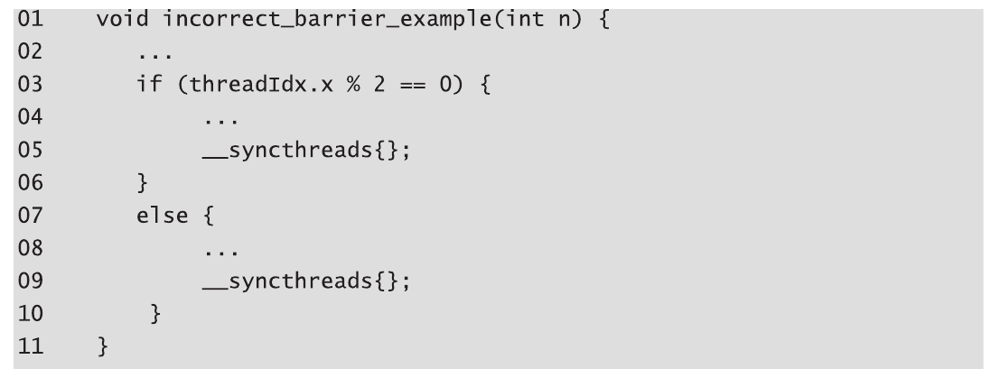

这引出了 CUDA 屏障同步设计中的一个重要权衡。通过禁止不同块中的线程进行`__syncthreads()`屏障同步，CUDA 运行时系统可以以任意顺序执行不同的块，因为它们中的任何一个都不需要等待其他块。

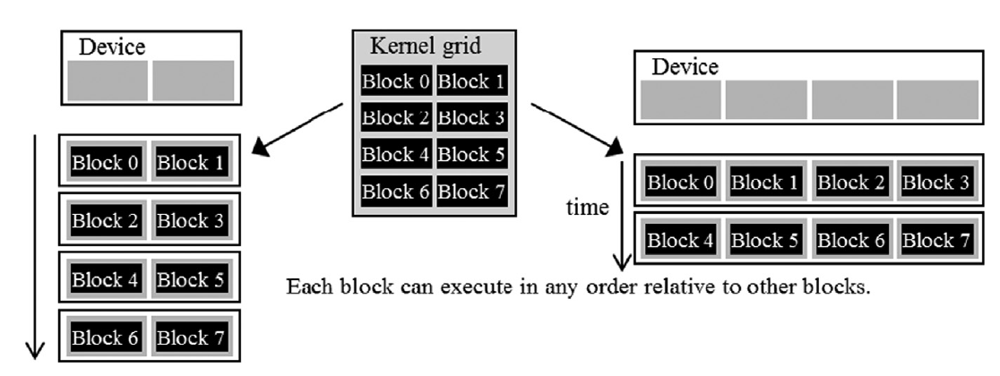

> 左边是只有 2 个 SM 的低性能设备，右边是有 4 个 SM 的高性能设备，同样的 CUDA 程序都能运行。

### 张量和 SIMD 硬件

冯诺依曼模型中，处理单元从 PC 中取一条指令到 IR 并执行，即使是多核 CPU 也同样要遵守该架构，每个核都有一个 PC 寄存器和一个 IR 寄存器：

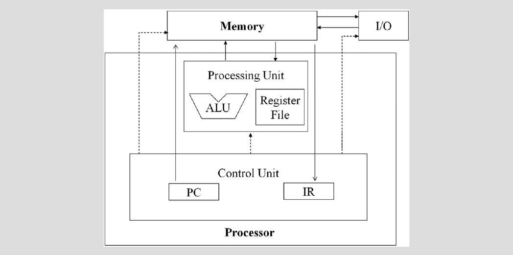

在 GPU 架构中，改进了冯诺依曼模型，使用**单指令多数据流**(Single Instruction, Multiple Data, SIMD)模型，多个处理单元共享 PC 寄存器，也就是说每个处理单元(CUDA 核心)每次执行的指令都相同，区别仅仅是访问的数据(共享内存、全局内存)的位置不同：

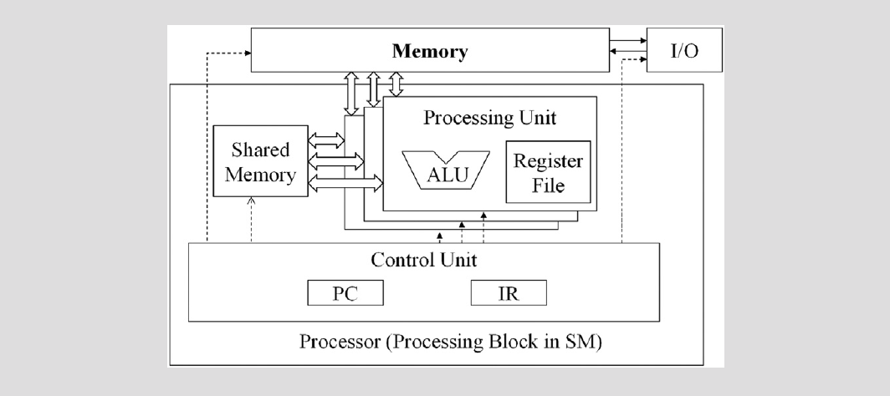

这是因为 GPU 的每个 CUDA 核心执行的核函数其实都是相同的，完全可以共享控制逻辑，而不像 CPU 每个进程的处理逻辑几乎完全不同，得益于该设计，GPU 的**控制单元**的芯片面积可以做到远小于 CPU。

在 GPU 中，每个 SM 都包含几组这样的结构，每组都包含一定数量的 CUDA 核心，每组之间共享控制单元(PC 和 IR 寄存器)，这样的组称为 warp，warp 是 SM 中线程调度的单元：

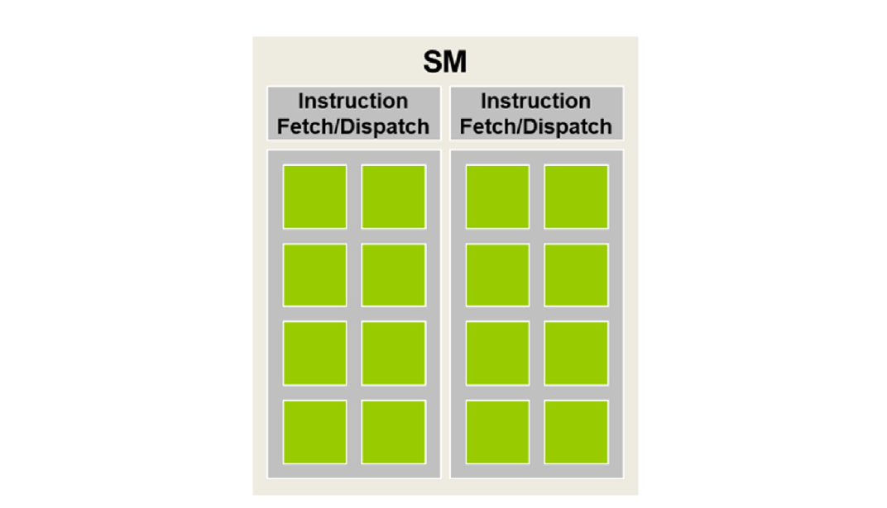

假设一个 wrap 包含 CUDA 核心数量是 32(即 32 个 thread)，如果每个块有 256 个线程，我们可以确定每个块有 256/32 = 8 个 warp。SM 可以“同时”执行 3 个块，可以理解为一个 SM 可以“同时”调度 8 \* 3 = 24 个 warp(当然并不是说一个 SM 里有这么多 wrap，实际上是没有这么多 CUDA 核心让它们同时运行的)。

### 控制分支

当 warp 中的所有线程在处理数据时都遵循相同的执行路径（更正式地称为控制流）时，SIMD 执行效果很好。

当同一 warp 中的线程遵循不同的执行路径时，我们说这些线程表现出控制分支，即它们在执行中分岔。

分支 warp 执行的多通道方法扩展了 SIMD 硬件实现 CUDA 线程的完整语义的能力。虽然硬件对 warp 中的所有线程执行相同的指令，但它**有选择地**只让这些线程在对应于它们所采取的路径的通道中产生效果，从而使每个线程都可以似乎采取自己的控制流路径。这保留了线程的独立性，同时利用了 SIMD 硬件的降低成本。

然而，分支的代价是硬件需要执行**额外的通道**，以允许 warp 中的不同线程做出自己的决策，以及每个通道中由非活动线程消耗的执行资源：

分支 if：

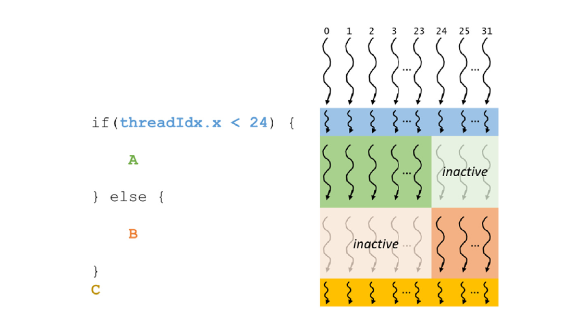

分支 for:

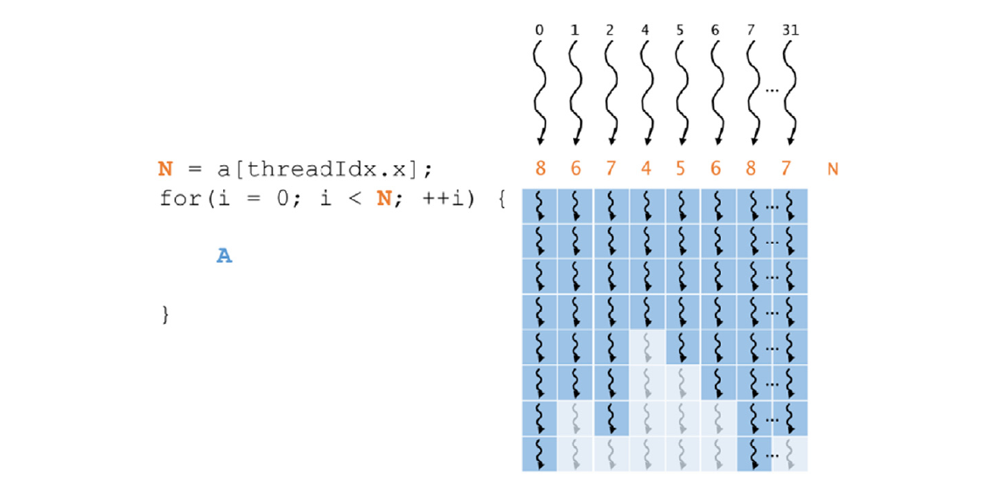

还有一种情况是实际数据数量和分配的线程不匹配的情况，比如数据是 1003 个，线程是 1024 个，则会有一个 warp 内的线程不足 32 个，不足的线程也会正常运行，但会因为 if 分支执行空操作，与正常的线程的控制流产生分岔。这种情况比较常见，但仅影响一个 warp，可以接受。

控制分支的一个重要含义是不能假设 warp 中的所有线程具有相同的执行时序。因此，如果 warp 中的所有线程必须在任何一个线程继续之前完成其执行阶段，必须使用类似于 `__syncwarp()`的屏障同步机制来确保正确性。

### Warp 调度和延迟容忍

当线程分配给 SM 时，通常分配给 SM 的线程比 SM 中的核心多。SM 同一时刻只能执行其所管理的所有 warp 中的部分 warp 的指令。

那么问题来了，如果它在任何时刻只能执行这些 warp 的一个子集，为什么我们需要给一个 SM 分配这么多的 warp？答案就是阻塞和多道程序处理机制。

warp 单元是可以调度的，当其执行访问全局内存这种高延迟 I/O 时可以进入休眠，让其他 warp 执行，从而提高效率。

warp 调度也用于容忍其他类型的操作延迟，如流水线浮点运算和分支指令。

### 线程、上下文切换和零开销调度

那问题又来了，实现类似操作系统的多道程序处理需要大量资源进行上下文管理，这怎么避免？

传统的 CPU 会因为从一个线程切换到另一个线程需要将执行状态（如传出线程的寄存器内容）保存到内存并从内存加载传入线程的执行状态而产生**空闲周期**。

零开销调度是指 GPU 能够使需要等待长延迟指令结果的 warp 进入休眠状态，并激活一个准备就绪的 warp，而不会在处理单元中引入任何额外的**空闲周期**。GPU SM 通过在硬件寄存器中保存所有已分配 warp 的执行状态来实现零开销调度，因此在从一个 warp 切换到另一个 warp 时不需要保存和恢复状态。

> 这是否意味着 SM 中所有 warp 的自动变量(也就是栈)也是独享的，这才能解释不需要做压栈操作。

为了使调度更加高效，希望一个 SM 分配给它的线程数量要比其执行资源同时支持的线程数量多得多，以最大化在任何时刻找到准备执行的 warp 的机会。例如，在 Ampere A100 GPU 中，一个 SM 有 64 个核心，但可以同时分配给它最多 2048 个线程。因此，SM 可以同时分配给它的线程数量最多比其核心在任何给定时钟周期支持的数量多 32 倍。对 SM 的线程进行过量分配是调度高效的关键。当当前执行的 warp 遇到长延迟操作时，它增加了找到另一个准备执行的 warp 的机会。

### 资源划分和占用

然而，并不总是可能将 SM 支持的最大数量的 warp 分配给 SM。分配给 SM 的 warp 数量与其支持的最大数量之比被称为占用率。

SM 中的执行资源包括:

- 寄存器
- 共享内存
- 线程块槽(thread block slots)
- 线程槽(thread slots)

这些资源在线程之间动态划分，以支持它们的执行。例如，Ampere A100 GPU 最多可以支持每个 SM 32 个块，64 个 warp（2048 个线程）和每个块 1024 个线程。如果以 1024 个线程的块大小（最大允许的大小）启动网格，则每个 SM 中的 2048 个线程槽将被划分并分配给 2 个块。在这种情况下，每个 SM 最多可以容纳 2 个块。类似地，如果以 512、256、128 或 64 个线程的块大小启动网格，2048 个线程槽将被划分并分配给 4、8、16 或 32 个块。

在块之间动态划分线程槽的能力使得 SM 变得多才多艺。它们可以执行许多每个具有少量线程的块，也可以执行少量每个具有许多线程的块。这种动态划分与固定划分方法形成对比，固定划分方法中，每个块将收到一定量的资源，而不考虑其实际需求。当块需要的线程少于固定划分支持的线程时，固定划分会导致线程槽浪费，而且无法支持需要更多线程槽的块。

资源之间的限制可能导致资源的低利用率，这会导致微妙的相互作用。这种相互作用可能发生在块槽和线程槽之间。在 Ampere A100 的例子中，我们看到块大小可以从 1024 变化到 64，分别导致每个 SM 有 2 ~ 32 个块。在所有这些情况下，分配给 SM 的线程总数是 2048，这最大化了占用率。然而，请考虑**每个块有 32 个线程**的情况。在这种情况下，需要将 2048 个线程槽划分并分配给 64 个块。然而，Volta SM 一次只能支持 32 个块槽。这意味着只有 1024 个线程槽将被利用，即 32 个块每个 32 个线程。在这种情况下，占用率为（分配的 1024 个线程）/（最大 2048 个线程）= 50%。因此，为了充分利用线程槽并达到最大占用率，**每个块至少需要 64 个线程**。

另一种可能对占用率产生负面影响的情况是，每个块的最大线程数不能被块大小**整除**。在 Ampere A100 的例子中，我们看到每个 SM 最多可以支持 2048 个线程。然而，如果选择块大小为 768，SM 将只能容纳 2 个线程块（1536 个线程），剩下 512 个线程槽未使用。在这种情况下，既未达到 SM 每个块的最大线程数，也未达到 SM 每个块的最大数量。在这种情况下，占用率为（分配的 1536 个线程）/（最大 2048 个线程）= 75%。

前面的讨论没有考虑其他资源约束的影响，例如寄存器和共享内存。在第 5 章“内存体系结构和数据局部性”中，我们将看到在 CUDA 内核中声明的自动变量存储在寄存器中。一些内核可能使用许多**自动变量**，而其他内核可能使用较少的自动变量。因此，应该预期一些内核每个线程需要许多寄存器，而其他内核每个线程需要较少的寄存器。通过在 SM 中动态划分寄存器，SM 可以容纳许多块，如果它们每个线程需要较少的寄存器，以及如果它们每个线程需要更多的寄存器，则需要较少的块。

然而，需要注意寄存器资源限制对占用率的潜在影响。例如，Ampere A100 GPU 允许每个 SM 最多使用 65536 个寄存器。为了以满占用率运行，每个 SM 需要足够的寄存器来支持 2048 个线程，这意味着每个线程不应使用超过（65536 寄存器）/（2048 线程）= 32 个寄存器。例如，如果一个内核每个线程使用 64 个寄存器，那么可以使用 65536 个寄存器支持的最大线程数为 1024 个。在这种情况下，无论块大小设置为多少，内核都无法以满占用率运行。相反，占用率最多为 50%。在某些情况下，编译器可能执行寄存器溢出以减少每个线程的寄存器需求，从而提高占用率水平。然而，这通常是以线程访问内存中的溢出寄存器值的执行时间增加为代价的，可能会导致网格的总执行时间增加。对共享内存资源在第 5 章“内存体系结构和数据局部性”中进行了类似的分析。

假设程序员实现了一个内核，每个线程使用 31 个寄存器，并将其配置为每个块 512 个线程。在这种情况下，SM 将同时运行（2048 个线程）/（512 个线程/块）= 4 个块。这些线程将使用（2048 个线程）\*（31 个寄存器/线程）= 63,488 个寄存器，低于 65536 个寄存器的限制。现在假设程序员在内核中声明了另外两个自动变量，将每个线程使用的寄存器数增加到 33。现在 2048 个线程所需的寄存器数为 67,584 个，超过了寄存器限制。CUDA 运行时系统可能通过将每个 SM 仅分配给 3 个块而不是 4 个块来处理此情况，从而将所需寄存器数降低到 50,688 个寄存器。然而，这会将在 SM 上运行的线程数量从 2048 减少到 1536；即通过使用两个额外的自动变量，程序看到了占用率从 100%降至 75%的减少。这有时被称为“性能悬崖”，即资源使用的轻微增加可能导致并行性和性能显着减少（Ryoo 等人，2008）。

读者应该清楚的是，所有动态划分的资源的约束以复杂的方式相互作用。准确确定每个 SM 中运行的线程数可能是困难的。读者可以参考 CUDA 占用率计算器，这是一个可下载的电子表格，根据内核对资源的使用，计算给定设备实现上每个 SM 上实际运行的线程数。

> 正因为计算的复杂性，类似 triton 的框架才有其价值


## 参考

[《Programming Massively Parallel Processors Fourth Edition》学习](https://fancyerii.github.io/2024/02/20/pmpp/)
